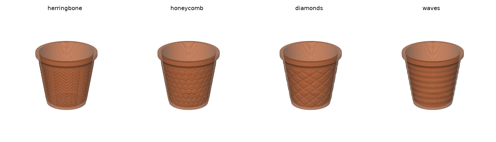
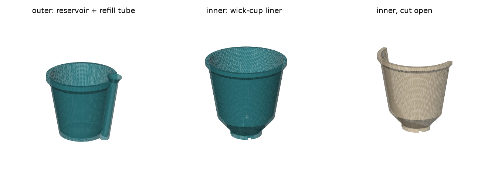
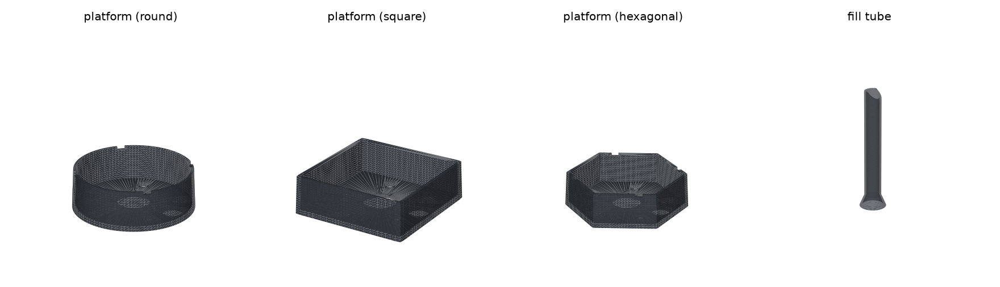
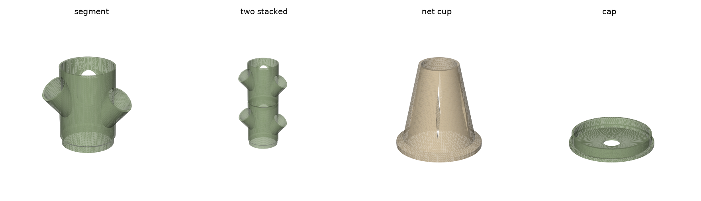
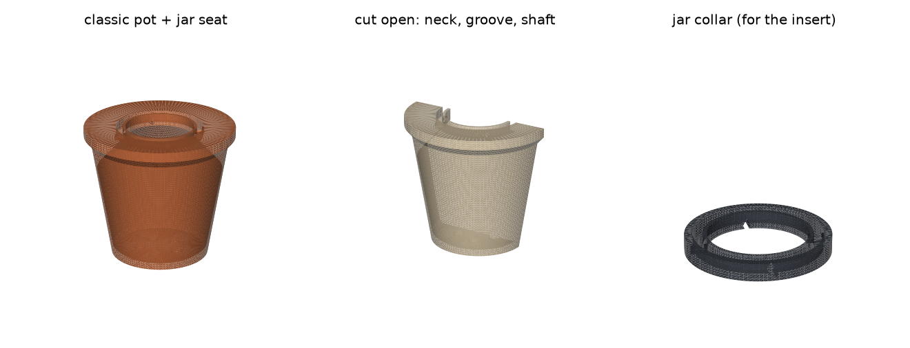

# Flower Pot STL Generator

Procedurally generate **watertight, 3D-printable flower pots** as `.STL` or colored
`.3mf` files from a handful of parameters. Four design styles, four surface textures,
four drainage layouts, an optional rim, a matching drip saucer, and a two-piece
**self-watering set** — every export is checked for manifoldness and unsupported
overhangs *before* it is written to disk. Runs locally or straight from a
**GitHub Actions workflow**, no install needed.




---

## Install

```bash
pip install -r requirements.txt
```

`manifold3d` is the important one: it is the exact boolean kernel trimesh uses to cut the
cavity and the drainage holes. Without it the booleans fall back to something far less
reliable and watertightness is no longer guaranteed.

## Quick start

**Option A — edit and run.** Open [`generate_pot.py`](generate_pot.py), change the values
in the `PARAMS` block at the top, and run it:

```bash
python generate_pot.py
```

```
classic_tapered.stl
  OK   watertight
  OK   consistent normals (no inverted faces)
  OK   positive volume, 0 degenerate faces
  OK   overhangs: worst 42.0 deg vs 45 deg limit
       77780 faces / 38882 vertices, genus 5
       size 162.0 x 162.0 x 145.0 mm, material 277.6 cm3, bed contact 80.9 cm2
  -> output/classic_tapered.stl
```

**Option B — command line.** Every parameter is also a flag:

```bash
python -m flowerpot --list-styles
python -m flowerpot --pot-style hexagonal --height 120 --top-diameter 130
python -m flowerpot --surface-texture honeycomb --color sage --format 3mf
python -m flowerpot --format both --preview                  # stl + 3mf + png
python -m flowerpot --all --generate-saucer --out output/    # one pot per style
python -m flowerpot --save-config mypot.json                 # save the settings
python -m flowerpot --config mypot.json                      # and reuse them
```

The CLI exits non-zero and refuses to write a file if the print audit fails; pass
`--force` to write it anyway.

**Option C — GitHub Actions, no local install.** Open the repo's **Actions** tab and
pick the product — each has its own *Run workflow* form:

| Workflow | What it makes |
|---|---|
| **Generate · classic pot** | the original pots: styles, textures, drainage, optional drip saucer |
| **Generate · self-watering set** | outer reservoir pot + inner wick-cup liner |
| **Generate · reservoir insert** | drop-in platform + fill tube for any existing pot |
| **Generate · hydroponic tower** | stackable column segments with angled plant ports + net cups |

Anything not on a form goes in *extra_args* exactly as you would type it on the CLI.
Every run uploads an artifact with the `.stl`, the colored `.3mf` and a `.png`
preview, and the job summary shows the full print audit — all three forms share one
generation job (`generate-common.yml`), so they cannot drift apart. A `tests`
workflow runs the suite on every push.

**Option D — as a library.**

```python
from flowerpot import PotParams, build_pot, audit

pot = build_pot(PotParams(pot_style="ribbed_spiral", height=180, rib_twist_degrees=60))
print(audit(pot))
pot.export("spiral.stl")          # a plain trimesh.Trimesh
```

---

## Styles

Set with `pot_style` / `--pot-style`.

| Style | Look | Knobs that matter |
|---|---|---|
| `classic_tapered` | Smooth traditional nursery / terracotta pot | `belly` (0 = straight cone, 0.10 = plump urn) |
| `low_poly_faceted` | Geometric crystal — stacked bands of facets that rotate half a facet per band | `facet_count`, `facet_bands`, `facet_rotate` |
| `ribbed_spiral` | Vertical flutes, optionally twisted into a spiral | `rib_count`, `rib_depth`, `rib_twist_degrees` |
| `hexagonal` | Modern six-sided prism with crisp corners | `hex_sides` (8 = octagon), `hex_corner_round` |

The cavity follows the same cross-section as the outside, so the wall stays a constant
thickness whatever style you pick. Ribs are the exception: they are added *outside* the
nominal wall, so the wall is never thinner than `wall_thickness`.

## Surface textures

Set with `surface_texture` / `--surface-texture` — a relief pattern pressed into the
outside of the wall, independent of the style (a honeycomb hexagonal pot or a diamond
spiral pot is fair game). Like the ribs, textures only ever *add* material outside the
nominal wall, fade out at the base and below the rim so both stay clean, and repeat a
whole number of times around the pot so there is no seam.

| Texture | Look |
|---|---|
| `herringbone` | columns of diagonal planks, direction alternating per column |
| `honeycomb` | raised hexagon tiles separated by grooves (a true hex Voronoi) |
| `diamonds` | quilted diamond tiles between two crossing groove families |
| `waves` | concentric horizontal ripples, like a coil-built pot |

Tune with `texture_depth` (default 1.0 mm — past ~2 the groove walls start flirting
with the overhang limit, and the validator says so) and `texture_cell` (pattern size,
default 16 mm). The one exclusion: `low_poly_faceted` ignores textures — its
deliberately sparse mesh has no vertices to carry them — with a warning. Combining a
texture with heavily twisted ribs (`rib_twist_degrees` > 25) stacks their slopes; the
validator warns and the audit has the final word.

## Colors and formats

STL carries no color, so the generator can also write **3MF** (`--format 3mf` or
`both`): the same audited mesh plus your color, which slicers pick up on import.
`color` takes a palette name (`terracotta`, `clay`, `white`, `black`, `charcoal`,
`sage`, `olive`, `teal`, `cobalt`, `sand`, `blush`, `mustard`) or any `#RRGGBB` hex.
`accent_color` optionally paints the rim a second color — in slicers that support
painted models you get a two-tone pot with no extra work.

`--preview` renders a PNG of the pot in its color (needs `matplotlib`); the image is
also embedded into the `.3mf` as its package thumbnail, so the pot shows its face in
file pickers and slicer project lists.

### Printer profiles (Creality Cloud, Creality Print, Bambu Studio, OrcaSlicer)

By default the `.3mf` also embeds a **slicer project payload** - machine, process and
filament settings in the shared OrcaSlicer / Bambu Studio / Creality Print (5.0+)
convention (`Metadata/project_settings.config` + plate assignment + BBS metadata).
That is what Creality Cloud's *"Print Settings"* upload path checks for; a plain
geometry 3MF gets rejected there with *"this file does not contain Creality's machine
models"* (it is still fine under *"STL/CAD files or other types of 3MF files"*).

Pick the machine with `--printer`: `creality-k1-max` (default), `creality-k1`,
`creality-ender3-v3-ke`, or `none` for a plain geometry-only 3MF. The profile is
conservative (0.4 mm nozzle, 0.2 mm layers, 3 walls, 15 % infill, generic PLA, and
the pot's `color` as the filament color), the object is placed at the middle of that
machine's plate, and the export warns if the pot doesn't fit the bed. Slicers treat
the payload as a starting point - anything can be adjusted after opening. The
geometry stays inline in the standard `3D/3dmodel.model`, so the file remains an
ordinary valid 3MF for every other consumer.

## Self-watering set



`--self-watering` swaps the single pot for a two-piece set, exported as
`<name>_outer.*` and `<name>_inner.*`:

* the **outer pot** (your style, texture and color) is watertight and holds the
  reservoir. A refill tube runs up the outside of the wall — leaning with the taper so
  it stays fused at every height — ending in a funnel above the rim; a port near the
  floor connects it to the reservoir. Pour into the funnel to top up the water.
* the **inner pot** is the plant liner. Its floor is a 50° cone descending to a central
  **wick cup**, which is also what it stands on — soil sits above the water line
  ("propped up"), and the two rims end flush. Thread cotton rope through the wick
  holes around the cup so it hangs into the water; notches at the cup's foot let the
  water level equalise into the cup for bottom-watering.

Both pieces print upright with no supports (the port and notches are diamond-shaped
for exactly that reason), and the tests prove the inner drops into the outer without
touching — including the boolean intersection of the assembled pair.

Tune with `reservoir_height` (35 mm — how much water the outer holds),
`refill_tube_bore` (16 mm), `wick_hole_radius` (4 mm), `num_wick_holes` (3) and
`sw_wall_gap` (5 mm between the walls). `low_poly_faceted` cannot host the refill tube
(its facets rotate with height), any other style works:

```bash
python -m flowerpot --self-watering --pot-style hexagonal --surface-texture honeycomb \
    --color sage --format both --preview
```

## Universal reservoir insert



Already have a pot — printed or store-bought? `--reservoir-insert` generates a
**drop-in platform + fill tube** that makes any *watertight* pot self-watering (the
pot's own bottom becomes the tank, so use a cachepot or plug the drainage hole).
Exported as `<name>_insert.*` and `<name>_insert_tube.*`, both already in their print
orientation — no supports, no flipping in the slicer:

* the **platform** stands on a skirt at `reservoir_height` above the pot floor. Soil
  sits on the deck; a slotted wick cone descends into the water and soil pressed into
  it wicks moisture up. Drainage holes let excess top-watering escape into the tank,
  fins stiffen the deck, notches in the skirt let the water level equalise, and a
  slight draft lets it drop into tapered pots.
* the **fill tube** slips through the platform's collared socket; funnel on top, tip
  mitered at 50° so water always finds a way out even with the tube standing square
  on the pot floor.

Measure your pot's **inside width** where the deck will sit and pick the matching
outline — the insert mirrors the pot's shape:

```bash
python -m flowerpot --reservoir-insert --insert-shape hexagonal --insert-width 132
python -m flowerpot --reservoir-insert --insert-shape square --insert-width 110 \
    --reservoir-height 30 --insert-tube-length 180
```

`insert_shape` (`round` | `square` | `hexagonal` | `octagon`), `insert_width`
(measured across the flats for polygons; the print comes out with fit clearance,
rounded corners accounted for), `insert_tube_length`, plus the shared
`reservoir_height` and `refill_tube_bore`.

## Hydroponic tower



`--hydro-tower` generates a vertical hydroponic garden: **stackable column
segments** whose chamfered spigots drop into the mouth of the segment below, with
plant ports spiralling up the column, plus the matching **slotted net cup** and a
**top cap** with a drip-line hole. Print one segment per level and
`ports_per_segment` cups per segment; the bottom segment stands in any watertight
vessel (a classic pot with `--drainage-pattern none` works).

The port angle is where printability lives: a round port tilted A° above horizontal
has its worst overhang at 90 − A°, so the default `port_angle` 48 lands at 42° —
inside the no-support budget. Anything below 46 is rejected rather than silently
printing badly, and the geometry keeps the top port's shroud clear of the stacking
zone (the tests stack two segments and prove zero intersection).

Tune with `tower_diameter` (110), `segment_height` (160), `ports_per_segment` (3),
`port_bore` (50 — the cups are sized to match), `port_angle` (48) and
`drip_hole_diameter` (22):

```bash
python -m flowerpot --hydro-tower --name tower --ports-per-segment 4 \
    --tower-diameter 125 --segment-height 180 --color sage
```

## Mason-jar greenhouse



`--jar-greenhouse` turns any pot mouth into a seat for an **upside-down canning
jar** — a mini greenhouse over the seedling. The interior necks inward (never
steeper than 42°, so it still prints support-free) into a shelf with a circular
groove; the inverted jar's lip drops in, an upstand ring keeps it centred, and the
plant grows through the shaft in the middle. Four vent notches punch through to the
shaft so the greenhouse breathes — the tests verify that topologically, because an
airtight cloche cooks the seedling.

It works on the **classic pot**, on the **self-watering set's inner liner**, and the
**reservoir insert** gains a standalone collar ring to set on the soil. Not
available on the hydro tower. Size it with `jar_mouth_od`: 86 (default) fits US
wide-mouth canning jars, 70 fits regular-mouth:

```bash
python -m flowerpot --jar-greenhouse                            # classic pot
python -m flowerpot --self-watering --jar-greenhouse            # set, seat in liner
python -m flowerpot --reservoir-insert --jar-greenhouse         # + collar ring
python -m flowerpot --jar-greenhouse --jar-mouth-od 70          # regular-mouth jar
```

Each workflow form has it too: the classic form's *Extras* picker
(`saucer_and_jar` gives you both), and checkboxes on the self-watering and insert
forms.

## Parameters

All dimensions in **millimetres**, angles in **degrees**. Defaults in brackets.

**Dimensions**

| Parameter | Default | Notes |
|---|---|---|
| `height` | 145 | build plate to rim |
| `top_diameter` | 150 | outside width at the top of the wall, *under* the rim |
| `bottom_diameter` | 105 | footprint width. Larger = more stable and less wall lean |
| `wall_thickness` | 3.0 | 2.4–3.2 mm suits a 0.4 mm nozzle |
| `base_thickness` | 5.0 | floor under the soil; keep above `wall_thickness` |

For the polygonal styles the diameters are measured **corner to corner**, so the
bounding box of the STL always matches what you asked for.

**Drainage**

| Parameter | Default | Notes |
|---|---|---|
| `drainage_pattern` | `"ring"` | `center` \| `ring` \| `grid` \| `none` |
| `drainage_hole_radius` | 6.0 | radius, not diameter |
| `num_drainage_holes` | 5 | used by `ring` and `grid` |
| `drainage_ring_fraction` | 0.55 | ring radius as a fraction of the usable floor |

Holes are always clipped to the flat part of the floor and spaced so they cannot merge
into a slot. Asking for holes that cannot fit raises `ParameterError` rather than
producing a broken mesh.

**Rim**

| Parameter | Default | Notes |
|---|---|---|
| `add_top_rim` | `True` | collar around the mouth |
| `rim_width` | 6.0 | projection past the wall, per side |
| `rim_height` | 10.0 | height of the straight collar |
| `rim_underside_angle` | 48.0 | chamfer under the rim, **from horizontal** |

**Print optimisation**

| Parameter | Default | Notes |
|---|---|---|
| `overhang_limit_deg` | 45.0 | steepest unsupported overhang, **from vertical** |
| `inner_base_chamfer` | 4.0 | 45° fillet where the inside wall meets the floor |
| `base_flat` | `True` | keep the footprint flat for bed adhesion |

**Texture** — `surface_texture` (`"none"`), `texture_depth` (1.0), `texture_cell` (16.0).

**Color** — `color` (`"terracotta"`), `accent_color` (`""` = single color).

**Printer** — `printer` (`"creality-k1-max"`); the machine profile embedded in the 3MF.

**Saucer** — `generate_saucer`, `saucer_clearance` (4.0), `saucer_height` (20.0),
`saucer_wall` (3.0), `saucer_base` (4.0). Written as `<name>_saucer.*`.

**Jar greenhouse** — `jar_greenhouse`, `jar_mouth_od` (86.0), `jar_seat_depth` (10.0).

**Self-watering** — `self_watering`, `reservoir_height` (35.0), `sw_wall_gap` (5.0),
`refill_tube_bore` (16.0), `wick_hole_radius` (4.0), `num_wick_holes` (3).

**Reservoir insert** — `reservoir_insert`, `insert_shape` (`"round"`),
`insert_width` (120.0), `insert_tube_length` (150.0).

**Hydroponic tower** — `hydro_tower`, `tower_diameter` (110.0), `segment_height`
(160.0), `ports_per_segment` (3), `port_bore` (50.0), `port_angle` (48.0),
`drip_hole_diameter` (22.0).

**Mesh quality** — `segments` (192 around the circumference; 128 is fast, 256 glassy) and
`vertical_step` (1.5 mm between rings). The faceted style deliberately ignores
`vertical_step` on the wall: long spans between rings are what make the facets flat.

---

## How the print requirements are met

**Manifold.** The two solids (body and cavity) are swept directly into triangle grids
with fan caps, so each is watertight by construction. Everything after that goes through
`manifold3d`, an exact boolean kernel: manifold in, manifold out. The finished mesh is
then re-checked — watertight, consistently wound, positive volume, no degenerate faces,
single body.

**No overhang past 45°.** Three things in a pot can overhang, and each is handled in the
geometry rather than left to supports:

* *The underside of the rim* is a chamfer, not a ledge. Its start height is solved by
  bisection so it hits `rim_underside_angle` exactly, whatever the wall is doing
  underneath it.
* *The decoration* (rib twist, facet rotation) is frozen at the foot of that chamfer. If
  the outline kept turning while the chamfer sloped outwards, the two motions would add
  up — that alone pushed the ribbed and faceted styles to 46–49° before it was fixed.
* *The wall lean* is `atan((top_radius - bottom_radius) / height)`; the validator warns
  before building if it exceeds the limit.

Every mesh is then audited empirically: each face normal is converted to a lean from
vertical (`arcsin(-nz)`), faces sitting on the build plate are excluded, and anything
past the limit is reported with its area. The defaults come out at 42°, comfortably
inside the limit.

**Flat base.** The footprint is a single flat disc on `z = 0`, and the report prints the
bed contact area (warning under 2 cm²). Pots are always dropped onto the plate and
centred in X/Y on export.

**Bonus check.** Each drainage hole that goes all the way through adds a handle to the
surface, so a correct pot has `genus == number of holes`. The tests assert exactly that —
it catches a hole that only dimpled the floor.

## Recipes

```bash
# 4" seedling pot with a single central hole
python -m flowerpot --height 90 --top-diameter 100 --bottom-diameter 75 \
    --wall-thickness 2.4 --drainage-pattern center --drainage-hole-radius 5

# chunky hexagonal succulent planter, no rim
python -m flowerpot --pot-style hexagonal --height 70 --top-diameter 95 \
    --bottom-diameter 85 --no-add-top-rim --drainage-pattern grid --num-drainage-holes 5

# tall spiral floor pot with a saucer
python -m flowerpot --pot-style ribbed_spiral --height 260 --top-diameter 220 \
    --bottom-diameter 170 --wall-thickness 3.6 --rib-count 30 --rib-twist-degrees 70 \
    --generate-saucer

# low-poly crystal, coarse and chunky
python -m flowerpot --pot-style low_poly_faceted --facet-count 6 --facet-bands 4

# two-tone quilted pot as a colored 3mf with a preview
python -m flowerpot --surface-texture diamonds --color cobalt --accent-color sand \
    --format both --preview
```

## Slicing

The pots are designed for **vase mode off**, 2–3 perimeters, 15 % infill, no supports.
A brim helps the taller ones. `wall_thickness` is deliberately a multiple of common
extrusion widths — 3.0 mm is 4 × 0.75 or 6 × 0.5 — so perimeters land cleanly and the pot
comes out watertight in the physical sense too.

## Project layout

```
flowerpot/
  params.py     PotParams - every knob, its default, and validation
  profile.py    the vertical silhouette (outer wall, rim, cavity, floor fillet)
  sections.py   the horizontal cross-section per style (round, polygon, ribs, facets)
  textures.py   the relief patterns (herringbone, honeycomb, diamonds, waves)
  build.py      sweeping, booleans, drainage, the saucer
  analysis.py   the print-readiness audit
  selfwatering.py the two-piece self-watering set (reservoir, tube, wick cup)
  insert.py     the universal drop-in reservoir insert (platform + fill tube)
  hydro.py      the hydroponic tower (segments, net cups, cap)
  jar.py        the mason-jar greenhouse seat and collar ring
  colors.py     the palette and hex parsing
  printers.py   machine profiles + the slicer project payload
  threemf.py    minimal colored-3MF writer (thumbnail + project settings)
  preview.py    headless PNG renders
  export.py     build -> audit -> stl/3mf/png, shared by every front end
  cli.py        argparse front end generated from PotParams
generate_pot.py the edit-and-run script
.github/        the "Generate flower pot" workflow + CI
tools/          docs image renderer
tests/          61 regression tests
```

## Tests

```bash
python -m pytest tests/ -q
```

They cover manifoldness and overhangs for every style and texture, dimensional
accuracy, measured wall thickness (by slicing the mesh and comparing the two loops),
drainage topology, saucer fit (boolean intersection with the pot must be empty),
texture guarantees (adds material only, seamless wrap, fades at base and rim),
STL and 3MF round-trips, color handling, parameter validation and the CLI.

## Previews

```bash
python tools/render_previews.py docs/img     # needs matplotlib
```
