# Flower Pot STL Generator

Procedurally generate **watertight, 3D-printable flower pots** as `.STL` or colored
`.3mf` files from a handful of parameters. Four design styles, four surface textures,
four drainage layouts, an optional rim, a matching drip saucer, and a two-piece
**self-watering set** — every export is checked for manifoldness and unsupported
overhangs *before* it is written to disk. Runs locally or straight from a
**GitHub Actions workflow**, no install needed.


**Gallery** — every option, pictured in its section:
[styles](#styles) · [textures](#surface-textures) · [drainage](#parameters) ·
[rim & saucer](#parameters) · [colors](#colors-and-formats) ·
[self-watering set](#self-watering-set) · [reservoir insert](#universal-reservoir-insert) ·
[hydroponic tower](#hydroponic-tower) · [jar greenhouse](#mason-jar-greenhouse) ·
[modular garden](#modular-garden) ·
[holiday pots](#holiday-pots-a-shape-with-a-season-and-a-face-through-it)

---

## Install

```bash
pip install -r requirements.txt
```

`manifold3d` is the important one: it is the exact boolean kernel trimesh uses to cut the
cavity and the drainage holes. Without it the booleans fall back to something far less
reliable and watertightness is no longer guaranteed.

## Quick start

**Option A — edit and run.** Open [`generate_pot.py`](generate_pot.py), change the values
in the `PARAMS` block at the top, and run it:

```bash
python generate_pot.py
```

```
classic_tapered.stl
  OK   watertight
  OK   consistent normals (no inverted faces)
  OK   positive volume, 0 degenerate faces
  OK   overhangs: worst 42.0 deg vs 45 deg limit
       77780 faces / 38882 vertices, genus 5
       size 162.0 x 162.0 x 145.0 mm, material 277.6 cm3, bed contact 80.9 cm2
  -> output/classic_tapered.stl
```

**Option B — command line.** Every parameter is also a flag:

```bash
python -m flowerpot --list-styles
python -m flowerpot --pot-style hexagonal --height 120 --top-diameter 130
python -m flowerpot --surface-texture honeycomb --color sage --format 3mf
python -m flowerpot --format both --preview                  # stl + 3mf + png
python -m flowerpot --all --generate-saucer --out output/    # one pot per style
python -m flowerpot --save-config mypot.json                 # save the settings
python -m flowerpot --config mypot.json                      # and reuse them
```

The CLI exits non-zero and refuses to write a file if the print audit fails; pass
`--force` to write it anyway.

**Option C — GitHub Actions, no local install.** Open the repo's **Actions** tab and
pick the product — each has its own *Run workflow* form:

| Workflow | What it makes |
|---|---|
| **Generate · classic pot** | the original pots: styles, textures, drainage, saucer / jar / planted-stem extras |
| **Generate · self-watering set** | outer reservoir pot + inner wick-cup liner |
| **Generate · reservoir insert** | drop-in platform + fill tube for any existing pot |
| **Generate · hydroponic tower** | stackable column segments with angled plant ports + net cups |
| **Generate · modular garden** | dovetail-connected seed trays, the flower set, the rotating stack |
| **Generate · simple pot** | thin-walled nursery pots: shape, scale, wall, side + bottom drainage |
| **Generate · bouquet planter** | a pot whose mouth is a ring of tulips or roses, each a planting pocket |
| **Generate · vase** | six curvy silhouettes × any style × any texture, plus the planted stem (fused or screw-in) |
| **Generate · trailer hitch mount** | a socket that snaps over a trailer ball, one piece or a screw-on collar |
| **Generate · yard art** | a sunflower, daisy or saguaro with a face, two rude hands and a hitch mount |
| **Generate · self-watering pair** | a 6 in. planter with an attached saucer, and the reservoir it drops into |

Anything not on a form goes in *extra_args* exactly as you would type it on the CLI.
Every run uploads an artifact with the `.stl`, the colored `.3mf` and a `.png`
preview, and the job summary shows the full print audit — all three forms share one
generation job (`generate-common.yml`), so they cannot drift apart. A `tests`
workflow runs the suite on every push.

**Option D — as a library.**

```python
from flowerpot import PotParams, build_pot, audit

pot = build_pot(PotParams(pot_style="ribbed_spiral", height=180, rib_twist_degrees=60))
print(audit(pot))
pot.export("spiral.stl")          # a plain trimesh.Trimesh
```

---

## Styles

Set with `pot_style` / `--pot-style`.

| Style | Look | Knobs that matter |
|---|---|---|
| `classic_tapered` | Smooth traditional nursery / terracotta pot | `belly` (0 = straight cone, 0.10 = plump urn) |
| `low_poly_faceted` | Geometric crystal — stacked bands of facets that rotate half a facet per band | `facet_count`, `facet_bands`, `facet_rotate` |
| `ribbed_spiral` | Vertical flutes, optionally twisted into a spiral | `rib_count`, `rib_depth`, `rib_twist_degrees` |
| `hexagonal` | Modern six-sided prism with crisp corners | `hex_sides` (8 = octagon), `hex_corner_round` |
| `square` | Four-sided box pot with rounded corners — the nursery classic | `hex_corner_round` |

The cavity follows the same cross-section as the outside, so the wall stays a constant
thickness whatever style you pick. Ribs are the exception: they are added *outside* the
nominal wall, so the wall is never thinner than `wall_thickness`.

## Surface textures

Set with `surface_texture` / `--surface-texture` — a relief pattern pressed into the
outside of the wall, independent of the style (a honeycomb hexagonal pot or a diamond
spiral pot is fair game). Like the ribs, textures only ever *add* material outside the
nominal wall, fade out at the base and below the rim so both stay clean, and repeat a
whole number of times around the pot so there is no seam.

| Texture | Look |
|---|---|
| `herringbone` | columns of diagonal planks, direction alternating per column |
| `honeycomb` | raised hexagon tiles separated by grooves (a true hex Voronoi) |
| `diamonds` | quilted diamond tiles between two crossing groove families |
| `waves` | concentric horizontal ripples, like a coil-built pot |

Tune with `texture_depth` (default 1.0 mm — past ~2 the groove walls start flirting
with the overhang limit, and the validator says so) and `texture_cell` (pattern size,
default 16 mm). The one exclusion: `low_poly_faceted` ignores textures — its
deliberately sparse mesh has no vertices to carry them — with a warning. Combining a
texture with heavily twisted ribs (`rib_twist_degrees` > 25) stacks their slopes; the
validator warns and the audit has the final word.

## Colors and formats

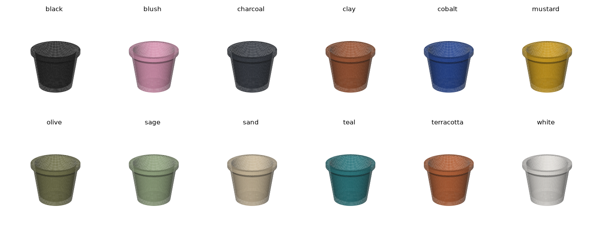

STL carries no color, so the generator can also write **3MF** (`--format 3mf` or
`both`): the same audited mesh plus your color, which slicers pick up on import.
`color` takes a palette name (`terracotta`, `clay`, `white`, `black`, `charcoal`,
`sage`, `olive`, `teal`, `cobalt`, `sand`, `blush`, `mustard`) or any `#RRGGBB` hex.
`accent_color` optionally paints the rim a second color — in slicers that support
painted models you get a two-tone pot with no extra work.

`--preview` renders a PNG of the pot in its color (needs `matplotlib`); the image is
also embedded into the `.3mf` as its package thumbnail, so the pot shows its face in
file pickers and slicer project lists.

### Printer profiles (Creality Cloud, Creality Print, Bambu Studio, OrcaSlicer)

By default the `.3mf` also embeds a **slicer project payload** - machine, process and
filament settings in the shared OrcaSlicer / Bambu Studio / Creality Print (5.0+)
convention (`Metadata/project_settings.config` + plate assignment + BBS metadata).
That is what Creality Cloud's *"Print Settings"* upload path checks for; a plain
geometry 3MF gets rejected there with *"this file does not contain Creality's machine
models"* (it is still fine under *"STL/CAD files or other types of 3MF files"*).

Pick the machine with `--printer`: `creality-k1-max` (default), `creality-k1`,
`creality-ender3-v3-ke`, or `none` for a plain geometry-only 3MF. The profile is
conservative (0.4 mm nozzle, 0.2 mm layers, 3 walls, 15 % infill, generic PLA, and
the pot's `color` as the filament color), the object is placed at the middle of that
machine's plate, and the export warns if the pot doesn't fit the bed. Slicers treat
the payload as a starting point - anything can be adjusted after opening. The
geometry stays inline in the standard `3D/3dmodel.model`, so the file remains an
ordinary valid 3MF for every other consumer.

## Simple nursery pots

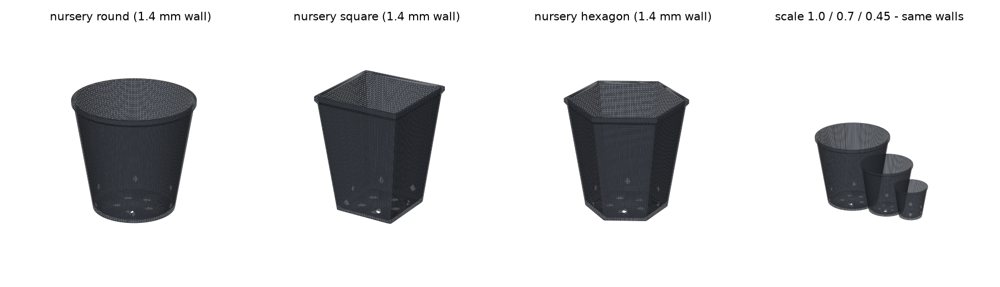

The flimsy-pot recipe — thin walls, plain shapes, practical drainage — is three
options that compose with everything above:

* **shapes**: `--pot-style` `classic_tapered` (round), `square`, `hexagonal`
  (`--hex-sides 8` = octagon);
* **`--scale`**: resize the whole design (0.2–3.0×) while `wall_thickness`,
  `base_thickness` and every print-fit clearance stay exactly as set — shrink a pot
  to seedling size without its walls becoming tissue paper, or blow it up without
  printing solid slabs;
* **`--num-side-holes`**: grow-pot drainage — diamond ports through the wall just
  above the floor (diamond so they print support-free), combinable with any bottom
  pattern or used alone.

These have their own workflow form — **Generate · simple pot** puts shape, scale,
wall thickness and both drainage locations directly on the form. On the CLI:

```bash
# a classic thin nursery pot
python -m flowerpot --wall-thickness 1.4 --base-thickness 2 \
    --rim-width 2.5 --rim-height 5 --drainage-pattern ring

# a square grow pot with side + bottom drainage
python -m flowerpot --pot-style square --wall-thickness 1.6 --num-side-holes 6

# the same pot at 60% size, walls unchanged
python -m flowerpot --scale 0.6 --wall-thickness 1.4 --base-thickness 2
```

## Vases and the planted stem

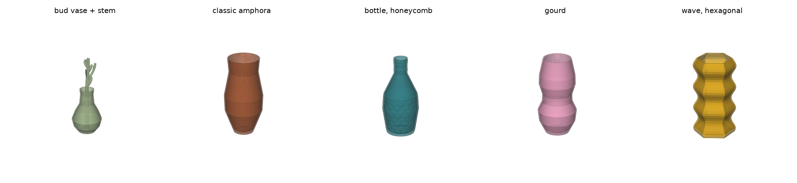

`--vase-profile` swaps the straight taper for a curvy silhouette: **classic**
(amphora), **bud**, **gourd**, **bottle**, **cone**, **wave**. `top_diameter` sizes
the vase's *widest* point and the mouth follows the shape; a curve too steep for
your height is rejected with the height that would fix it — both the outside and
the inside of every bend stay inside the overhang budget. Because the curve plugs
in at the wall level, everything composes: a honeycomb bottle, a hexagonal wave
vase, a low-poly gourd. Textures automatically melt away over a curve's steep
stretches (belly climbs, bottle shoulders) so they never stack past 45°.

**`--stem`** grows the fun one: a hollow tapered stem rises from the vessel's floor
to `stem_length` above the rim, with `num_leaves` lens-shaped leaves spiralling up
at the golden angle. The leaves tilt `leaf_angle` (hard-capped at 30°) off the stem
so everything prints support-free. Drop a real flower or two into the `stem_bore` —
in a watertight vase the bore holds water — and the vase reads as the flower's own
stem. **Water holes** (diamond ports, support-free) spiral up the submerged part of
the stem, so the vessel's water reaches the real stem inside the bore. Works on any
vase profile or plain pot (bonsai-pot look).

The stem isn't a bare pole: `stem_curve` sways it into a gentle lean above the rim
(dead straight below, where the socket and water holes live), and `num_branches`
side stems fork off it — leaving at ~35° so they print support-free, easing upright
as they climb, each ending in its **own open bore joined to the main water column**.
One flower per branch. Branches that wouldn't fit under the stem tip shorten or
skip themselves automatically.

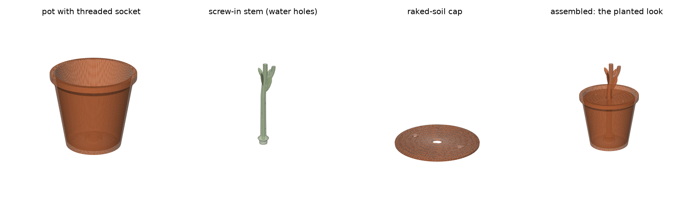

**`--stem-mount screw`** splits the stem into its own piece: the vessel grows a
threaded socket on its floor and the stem is written as `<name>_stem.*` with a
matching threaded stub (coarse 5 mm-pitch thread, flanks and run-outs all inside the
45° overhang budget, 0.3 mm clearance — no tuning needed). Unscrew it to clean the
vase properly, or print a stem *taller* than the vessel. Drainage holes that would
land under the socket are dropped automatically.

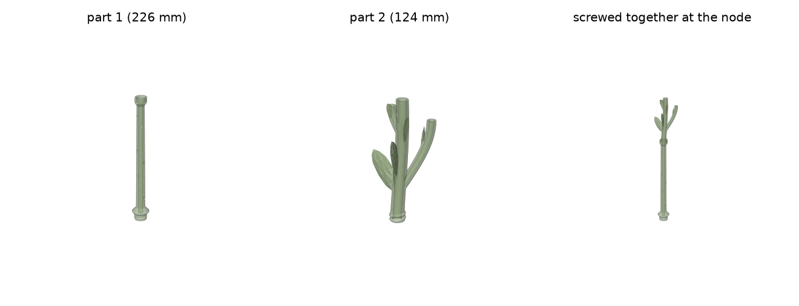

A screw-in stem can easily out-grow the printer — a 220 mm vase with a 130 mm stem
makes a 341 mm part — so it splits again at threaded **nodes**, and the pieces are
written as `<name>_stem_part1`, `part2`, … Each node is a bamboo-like swelling,
because the shaft is barely thicker than its own bore and the thread needs somewhere
to live. Nodes are placed as high as three rules allow: no section taller than the
bed, none below the rim (a joint down there sits in the water and would weep), and
never inside a leaf or branch, which would leave a fragment floating beside the
shaft. Screwed together the stem is identical to the one-piece version.
`stem_split` is `"auto"` by default — `"never"` keeps one tall piece (you still get
the bed warning), `"always"` forces a node, which is handy for shipping or storage.
The upper sections stand on a small stub, so slice them with a brim.

**`--soil-cap`** completes the potted-plant illusion: a removable lid written as
`<name>_soil_cap.*` that rests in the pot's taper just below the rim, sculpted like
raked soil (every bump faces up, so it prints flat with zero supports), with a
centre hole the stem passes through and two finger holes that double as watering
holes. Lift it out by the finger holes to water or to unscrew the stem.

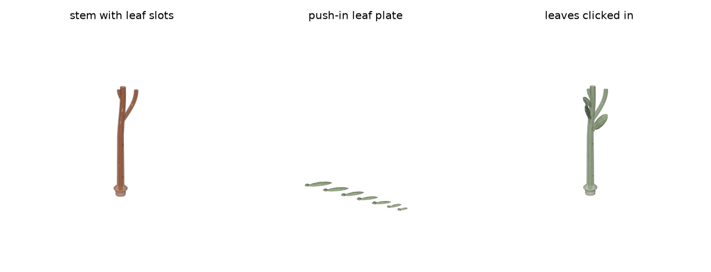

**`--leaf-mount insert`** makes the leaves separate push-in pieces, so a
single-color printer can print the vase, the stem and the leaves in three
different colors or filaments. The stem gets vertical gable-roofed slots
(support-free in the standing print) and the whole foliage is written as
`<name>_leaves.*` — a flat plate of leaves, biggest first, each with a tab that
slides into any slot of its size (big tabs = main stem, small tabs = branches).
Each blade carries a saddle matching the stem's curve so it seats flush. Two
bonuses: the leafless stem is an even easier print, and because insert leaves
print flat, `leaf_angle` may go up to **60°** — drooping foliage the fused
version can't do. Flip a leaf in its slot and it droops the other way. The fit
is a light friction fit; a dot of glue makes it permanent.

```bash
python -m flowerpot --vase-profile classic --height 220 --top-diameter 110 \
    --drainage-pattern none --no-add-top-rim
python -m flowerpot --vase-profile bud --stem --height 180 --top-diameter 120 \
    --drainage-pattern none --no-add-top-rim --color sage
# the full planted-pot set: pot + socket, screw-in stem, raked-soil cap
python -m flowerpot --stem --stem-mount screw --soil-cap --stem-length 90
```

## Bouquet planter

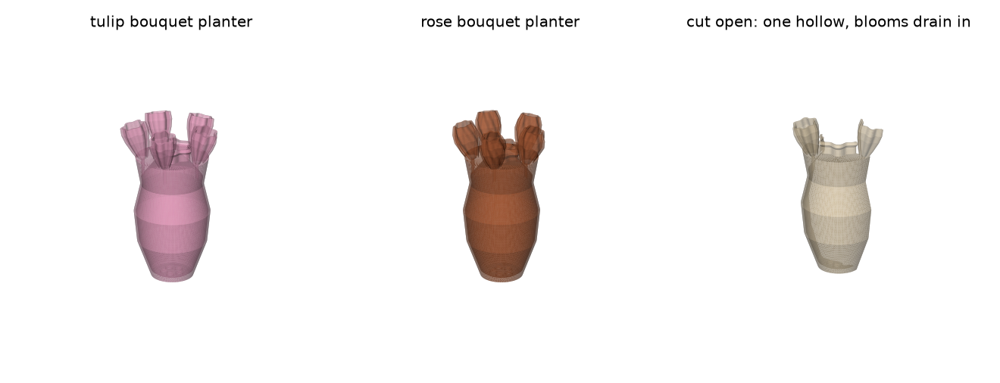

`--bouquet` turns the pot's mouth into a cluster of blooms. The vessel gathers to
a wide shoulder, the mouth itself flares open as a scalloped flower — that is the
planting well — and a ring of `bouquet_count` (3-8) **tulips** or **roses** stands
around it, each a hollow pocket for a succulent with a drain into the body below.
One piece, one hollow, no supports, and the base drains like any other pot.

Three things earn their keep in the geometry, and all three are about the same
question — *does this surface face down?*

* **The interior's ceiling.** Blooms need a solid shoulder to stand on, so the
  cavity cones in (at ~52° from horizontal) to the mouth's throat rather than
  running straight up to a rim. Every bloom foot is checked to sit on that
  shoulder — outside the throat, inside the wall, and clear of the cone at the
  depth it sinks to.
* **Where two blooms overlap.** Two cups that are both still flaring meet in a
  *valley*, and a valley drains to the sky: blooms may overlap freely down low,
  which is exactly the gathered look. What is not allowed is one bloom's closing
  top meeting its neighbour, because the pair roof the gap between them. The
  layout walks both silhouettes and only demands clearance from the height where
  one of them starts closing over.
* **The rose's spiral.** Winding the petals as they rise adds
  `radius x amplitude x petals x (dθ/dz)` of gradient — which grows with the cup's
  radius and shrinks with its height, so it is the *widest shallow* cup that blows
  the budget, not the tallest. The wind is capped against the same overhang budget
  as everything else.
* **The hollow inside the shoulder.** That solid shoulder is the heaviest thing
  in the model — a third of it, in a band a few centimetres tall — and most of it
  carries nothing. It is carved out from the inside, which a flat-roofed void
  cannot be: the deck over it would be a horizontal ceiling. So the void is a
  *tent*, an annular chamber whose roof rises to a ridge from both sides at the
  same 38° the rest of the model is held to, one deck below the top and one wall
  thickness above the cone. Radial ribs at the midpoints between blooms cut the
  ring into one pocket per bloom, and that bloom's own drain runs straight through
  its pocket on the way to the body — so each pocket empties, the ribs carry the
  deck where the blooms actually stand, and the pot stays one piece with exactly
  the tunnels it had before. It takes **8-15% off the whole model**, more on the
  big ones, and needs no parameter: the ridge radius is swept and measured, not
  guessed, and a pot too small to carve is simply left solid.

Blooms are sized from the pot and shrink automatically until the ring fits; set
`bouquet_head_diameter` to pick a size yourself. `bouquet_tilt` leans the ring
outward (capped at 18° — the lean adds to each cup's own flare). Bouquet mode
defaults to a **trumpet** silhouette that opens back out at the top, because the
ring needs a wide shoulder; a narrow-necked vase like `bud` is rejected with the
mouth width it would need.

```bash
python -m flowerpot --bouquet --color blush
python -m flowerpot --bouquet --bouquet-flower rose --bouquet-count 7 \
    --height 210 --top-diameter 130 --color clay
```

## Self-watering pair

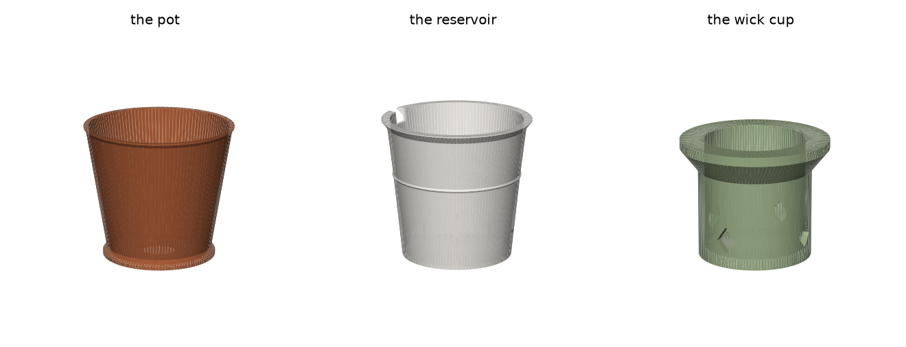

Two shop vessels and the pair they make: a **6 in. round planter with an
attached saucer** (6.00 in. mouth, 4.70 in. saucer, 5.51 in. tall) and a
**reservoir** in the manner of a 2.5 qt mixing bucket, sized so the pot drops
into it and the two rims finish flush.

```bash
python -m flowerpot --replica set --color clay
python -m flowerpot --replica set --replica-standoff 35    # more water
python -m flowerpot --replica kyra --no-replica-plumbing   # the bare pot
```

`set` writes three parts — `<name>_pot`, `<name>_reservoir` and `<name>_wick`.
`kyra` and `hdx` write one each. Every dimension of the pot is a parameter, so
a tape measure beats the listing whenever one is to hand; the reservoir is
always derived from whatever the pot ends up being, and there is a boolean fit
proof in the tests to say so.

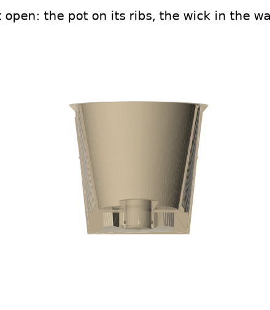

### The trade you cannot dodge

**Flush rims, a real reservoir, and the shop bucket's depth are three things
you can have two of.** A pot resting on the floor of a 2.5 qt bucket leaves a
couple of hundred millilitres in the gap around it at best; lifting it far
enough to matter makes the bucket that much deeper than the one on the shelf.
`replica_standoff` is that dial — 25 mm by default, which keeps the rims flush
and holds about 215 ml. Set it to `0` for the bucket's own proportions and
almost no water.

### What a printer cannot copy

The real pot's saucer is a **tray** — a moulded cavity under its floor. Printed
standing up that cavity is a ceiling the full width of the pot, and no cone
closes a 110 mm span. So the replica's saucer is a solid flared foot: the same
silhouette from outside, no tray. The generator says so in a warning rather
than quietly handing you something different from the photograph.

### The plumbing

* **Ribs** stand up off the reservoir's floor for the pot to land on. The
  standoff has to come from *below* — a shelf moulded round the inside of the
  wall would be a ledge facing straight down.
* An **overflow** through the wall sets the water line a finger's width under
  the pot's floor, so the soil never sits in water. It is a diamond port, not a
  round hole: a round hole through a standing wall has a ceiling across its top.
* A **notch** in the rim is what you pour through. The gap between the two rims
  is a couple of millimetres, which no watering can will ever find.
* The **wick cup** is its own part. It drops through the pot's floor and hangs
  into the water; pack it with the same soil and it carries the water up. It is
  separate because hanging it off the pot's floor would leave that floor
  spanning the whole pot with nothing under it.

## Hanging cradle

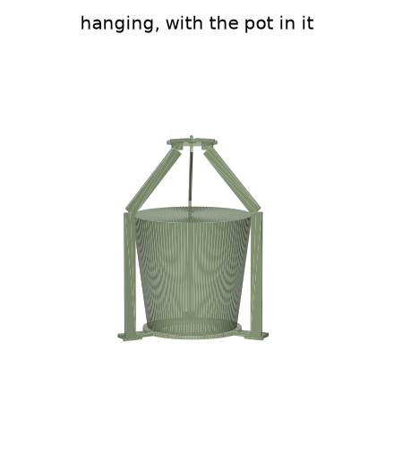

> **Reach for the rim loops first.** If you are printing the pot, put the mount
> *in* the pot — `--hang-loops 3` is nothing to assemble, no extra parts, and
> the cord carries the load instead of the plastic. The cradle is for a pot you
> **did not** print: a nursery pot, or something from a shop.
>
> Two things to know before you print one. The arms' toggle joint has **no
> proven assembly path** — a sweep of tilt against lift never finds a clear
> route for the return through its slot, bottoming out at 17–46 mm³ of
> interference. Small enough that it probably goes together with a little flex,
> but the wall parts prove to zero and this does not. And nothing in the
> geometry fixes **creep**, which is what actually breaks a printed hanger.

Flat parts that hang a pot **you did not print** — from a ceiling hook, or off a
wall on a French cleat. Everything else in this generator is held up by the
bench; this is not, and a hanging pot is a **sustained tensile load** on printed
plastic, the one thing FDM is worst at. The whole design is arranged round that.

```bash
python -m flowerpot --hanger set --hanger-pot-size 6in --hanger-load 5
python -m flowerpot --hanger set --hanger-arms 4 --hanger-top slot
python -m flowerpot --hanger arm --hanger-drop 320 --hanger-pot-size 8in
python -m flowerpot --hanger set --hanger-mount wall --hanger-reach 150
```

### Print orientation is the design

A printed part is weakest **across** its layer lines. An arm printed standing
up is a stack of discs being pulled apart, and it lets go at a layer bond long
before the plastic yields. So every part here is a **flat plate, printed lying
down**, with the tension running along the layer lines. The parts are modelled
in that attitude — lay them on the bed exactly as they come out of the
generator, and the tests assert that each part's thinnest dimension is its
thickness.

That one decision settles the rest of the shape. A flat plate can only widen in
its own plane, so every joint here works in the plane of the plate.

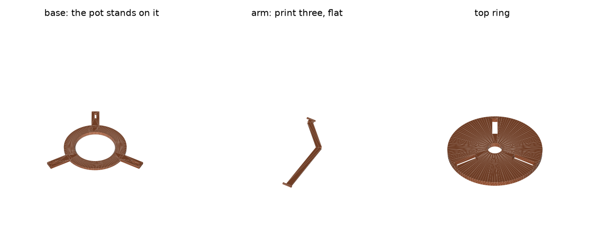

### The joint is a toggle

Both ends are the same: a plain slot through the plate, and a **return** on the
end of the arm that is longer than the slot. The arm threads through — up from
under the base, down through the top ring — and its return lies across the slot
and cannot come back.

It goes together because a plate tilted over presents a shorter shadow: tip the
arm about 50° and the return passes; stand it up and it does not. Hanging, every
arm is within a few degrees of vertical. No fasteners, no open-ended notches for
a hook to walk out of, and — because the slots are closed all round — the top
ring keeps a **solid middle** to hang from.

The arm stands vertical again for the last few millimetres before the top ring,
because an inclined plate through a horizontal slot needs a longer slot and
lands its load at an angle.

### What actually fails

**Not the arm.** At the loads a pot reaches, the tensile section is enormously
oversized — about 0.5 MPa at the default 5 kg. The sizing lands on the **plates
in bending** instead: the base's spokes and the top ring. The generator reports
the stress in each and says which one governs, and there is a test asserting the
arm is *not* the governing section, because knowing that is the difference
between a number and an understanding.

**What does fail is creep.** PLA under a load that never comes off slowly
stretches, and a hanging planter is about as permanent a load as a household
part sees. No geometry fixes that: print it in PETG or PLA+, look at it now and
then, and don't hang it over anything that would mind it coming down. The
generator says so every time.

`hanger_load` is the weight of the pot, its soil and its water at their
heaviest. **One arm is assumed slack** — a hanger that has swung is carrying on
the others, and that is the case worth sizing for.

### Sizing

Same nominal nursery table as the sleeve and the under-pot parts, with the same
warning that it is nominal. `hanger_drop` is base ring to top ring; the arm is a
little longer than that and has to lie flat on the bed, so the generator checks
it against your printer and tells you if it only fits diagonally.

A hanging pot drips — `--underpot tray` is the companion part.

### Off a wall instead: `--hanger-mount wall`

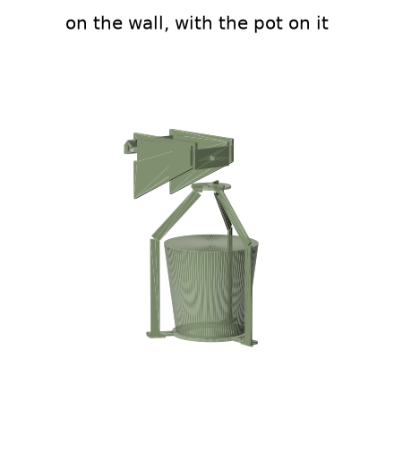

The same set, on a wall rather than a hook. It adds three more flat parts: a
**cleat** (the rail that screws to the wall), a **rib** (print two) and a
**yoke** (the beam between them, with the eye the pot hangs from).

A French cleat is a board ripped at 45°, and 45° is exactly this generator's
overhang limit — so the joint that makes a cleat work is also the one angle
that prints with nothing under it.

**But a bracket is not a hook.** A hook carries tension. A bracket carries a
**cantilever**: 5 kg at 150 mm of reach is 7.4 N·m at the fixing, an order of
magnitude more than anything else here. Two things follow, and they are the
whole design:

**A bare French cleat only resists shear.** It has nothing to say about a
moment, which tries to peel the top of the cleat straight off the wall. So each
rib's **back edge bears flat on the wall below its notch**, and the moment
becomes a couple: the back pushes in low down, the notch holds out up top.

**Which way you rip the cleat decides whether it holds at all.** The rail's
bevel here rises *away* from the wall. Tip the rib the way a cantilever tips it
— top out, bottom in — and the notch's ceiling drives down and out **into** the
rail. Rip it the other way round, the way a picture rail usually is, and the
same motion slides the two bevels apart. There is a test for exactly this,
because getting it backwards produces a bracket that looks right and falls off.
The same orientation means the bracket cannot be pulled straight off the wall
either: you have to lift it the rail's full depth first.

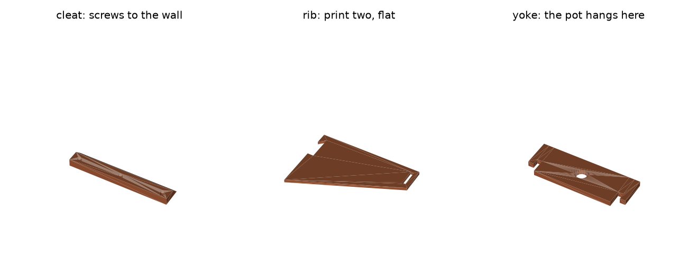

A shelf bracket is a plate on edge, not a ribbon, for the same reason the arms
are — so the reach is carried by two ribs standing on edge. Everything about a
rib is *outline*: the hook, the taper and the yoke's slot are all edges in the
plane it prints in, so a rib has no overhang anywhere by construction.

**The rib tapers, because the moment does — but not to a point.** With the load
hung at the tip, the section of a triangle falls away faster than the moment
does, and the worst stress ends up out near the tip rather than at the wall. So
the rib keeps a tip deep enough for what is left, and the generator reports how
far out along the rib the worst section actually is.

**The yoke's catch is the only kind a flat part can have.** A part that prints
flat can only grow in its own plane, so a return can never be wider than its
slot in the direction it slides through it. The lug on the end of each tenon is
wider the *other* way instead: hold the yoke 6 mm high and slide a rib onto each
end, then let it down, and each lug drops below its slot with the rib in front
of it. Then hook both ribs over the rail.

**The screws are the part this generator does not make.** How many there are is
worked out from the pull-out the cantilever produces — the rail in bending
between its screws is usually what governs the whole mount — and they are
countersunk 80°, not 90°, because 90° would be exactly the overhang limit with
nothing left over. What they go into is yours: a stud, or a plasterboard fixing
rated well past the numbers the generator prints.

```bash
python -m flowerpot --hanger set --hanger-mount wall --hanger-reach 150
python -m flowerpot --hanger set --hanger-mount wall --hanger-load 10 \
    --hanger-cleat-length 200
python -m flowerpot --hanger rib --hanger-mount wall   # just print one more
```

## Holiday pots: a shape with a season, and a face through it

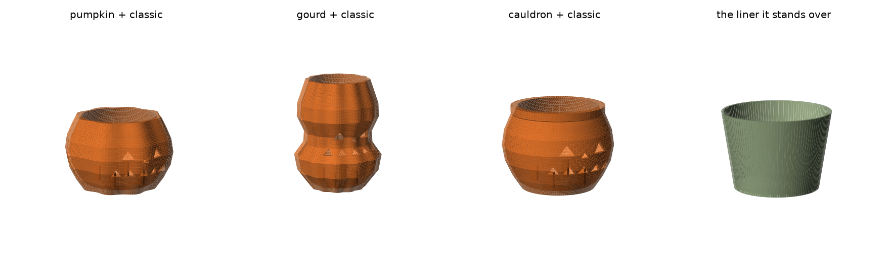

`--holiday pumpkin` is a squat lobed sphere that stands on its own lobes, and
`--holiday-face classic` cuts a jack-o'-lantern straight through the wall. The
set writes two parts: the **pot**, and a **liner** that drops in and holds the
soil back behind the face.

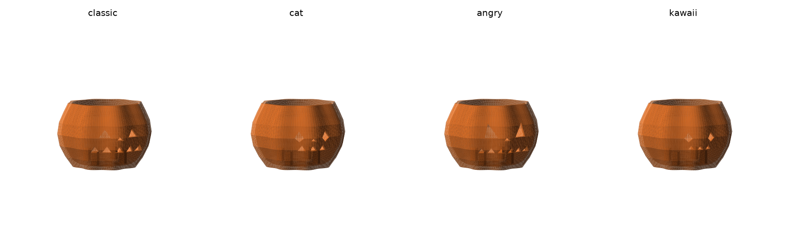

```bash
python -m flowerpot --holiday pumpkin --holiday-face classic \
    --height 105 --top-diameter 150 --bottom-diameter 105 --color '#e8752a'
```

Three shapes, four faces, and the shapes want different proportions —
`pumpkin` about 0.7 times as tall as it is wide, `cauldron` 0.75, `gourd` 1.3.
Ask for the wrong one and the generator says which height would fix it rather
than quietly building something that leans.

### Nothing here is a new kind of geometry

That is the whole point of the module. A holiday shape is a **silhouette**, a
**rib count** and a **rib depth with the twist turned off** — parameters the
generator already had. So a pumpkin is a `ribbed_spiral` pot at zero twist, and
every texture, colour, drainage pattern and style option still works on it.

The lobes matter twice. `ribbed_spiral` adds its ribs *outside* the nominal
wall rather than carving them into it, so the pot is never thinner for having
lobes; and with `base_flat` off they run all the way to the bed, so the pot
stands on eight little pads of its own — which is what a pumpkin does.

### Every hole in the face is pointed, and that is not a compromise

A round eye is a ceiling. A flat-topped grin is a ceiling. A ceiling over a
hole in a vertical wall needs supports, which is exactly why the side drainage
ports in this generator are diamonds and not circles.

So every feature of a face here is a **pointed port** — a prism whose roof
comes to a peak, two faces inside the overhang budget instead of one flat span
across the top. The roofs rise 1.35 per unit of half width, about 53°, against
a 45° budget.

None of that costs the look, because **a carved pumpkin was always this
shape**. Its grin is a row of pointed cells; the triangles of material between
the gaps are the teeth, and the gaps come to a point because the teeth do.
Carve the classic face and you have carved a printable one.

The teeth point **up**, always, and that direction is the one real constraint.
A tooth hanging down from the top of the mouth starts, layer by layer, as a
speck of plastic in mid-air with nothing under it. A tooth standing up off the
bottom of the mouth only ever narrows as it rises. So the mouth is a row of
gaps pointed at the top, and the eyes and nose are triangles standing on a flat
base — the base faces up, so it is free.

### How you know the face came out

The pot's **genus** has to equal its drainage holes plus one per port. A blind
pocket adds nothing to the genus and a through hole adds exactly one, so the
count is an exact statement that every feature went all the way through and
that no two of them ran together.

It is not a theoretical check. It caught two real bugs here, both invisible in
a render:

* the grin's cells overlapped, so five gaps came out as one slot with no teeth
  in it — the genus was four short;
* the cutters were cut to the **rim's** radius, and every one of these shapes
  has a belly wider than its mouth, so three ports stopped inside the wall and
  left blind pockets that look like holes from the inside.

`holiday_face_scale` sizes the face, and the generator refuses a face whose
holes would run into each other, whose roof would drop under the budget, or
that would reach into the floor or break the rim. The thinnest tooth it will
leave is 2.4 mm.

### The liner, and the number nobody would guess

A face cut right through is a hole into the soil. The liner is a plain tapered
cup that drops in and holds the soil back.

It has to be a **cone**, not a copy of the cavity: the pot's mouth is narrower
than its belly, so nothing belly-shaped would go in through it. That leaves a
gap between the liner and the wall — which is the right thing to see through a
jack-o'-lantern's eyes anyway.

It stands on four **posts** on the pot's floor, 22 mm up, so its drainage holes
are not pressed flat against the floor. Posts rather than a shelf or feet, for a
reason worth stating: a post is vertical on every side and flat on top, so it
adds no overhang anywhere. A shelf around the cavity would need chamfering
underneath, and feet on the *liner* would not work at all — feet hold a floor up
in the air, and that floor is a ceiling to whatever prints under it.

**All the drainage is in the liner.** The pot itself keeps its own base holes,
but nothing is ever cut into the face pot for water — the face is hole enough.

And the number: the lowest hole in the face is the **waterline**. Fill past it
and it runs down the outside. For the default pumpkin that is about 246 ml of
free space, counting the posts and the liner as the obstructions they are. The
well under the liner is about 215 ml — with the pot's own drainage on that is
clearance and the water runs through; set `--drainage-pattern none` and it is a
reservoir instead.

```bash
python -m flowerpot --holiday cauldron --holiday-face angry --height 112
python -m flowerpot --holiday gourd --holiday-face cat --height 170 \
    --top-diameter 130 --bottom-diameter 95
python -m flowerpot --holiday pumpkin --holiday-face none   # a plain lobed pot
```

## Hanging pot: loops on the rim

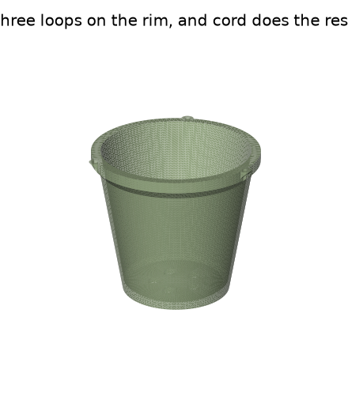

The same argument as the wall pot, pointed at a ceiling. **This is the way to
hang a pot you printed yourself.** The hanging cradle below is a gadget — five
printed parts that grip a pot somebody else made — and it is the right answer
only when the pot came from a shop.

```bash
python -m flowerpot --hang-loops 3
python -m flowerpot --hang-loops 4 --hang-loop-bore 8 --pot-style hexagonal
python -m flowerpot --hang-loops 3 --hang-ceiling-plate
```

It beats the cradle in three ways. Nothing to assemble. The parts count drops
from five to none, because the loops are part of a pot you were printing. And
**the cord carries the tension** — cord does not creep, which is the one failure
mode the cradle's own documentation admits no geometry can fix.

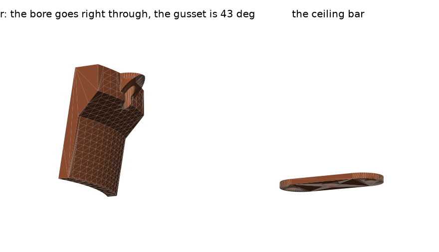

### The one thing to be careful about

A pot prints standing up, so a cord pulling up on its rim pulls **across the
layer lines** — the direction printed plastic is genuinely bad at, and the one
the cradle is contorted to avoid.

It is fine here, and the reason is worth stating rather than assuming: the
cradle's arms had a section set by the arm; this has a section set by *the rim*,
which is enormous by comparison. The loops work at about **0.14 MPa against an
interlayer working stress of 3.0** — more than twenty times over. The generator
prints both numbers rather than waving at them, and refuses if the margin goes.

`_SIGMA_Z` is 3.0 MPa where everything else in the repo uses 8.0, because a
layer bond is not the plastic.

### Why a bore and not an eye

A horizontal eye for an S-hook needs a gabled roof to print, *and* it puts the
pull on a fin standing off the rim — about a tenth of the section, in the same
bad direction. A **vertical bore** through a locally widened rim keeps the load
in the rim's own plane, where the layers are, and needs no roof at all.

Each ear is gusseted underneath by a 43° cone that is a local flare of the pot's
*own wall*, so it springs from material rather than from air. On a polygon that
matters: the outline's polyline carries its **corner** radius, so an ear placed
at that distance hangs over a flat with its gusset springing from nothing. Each
ear is placed off the wall's radius *at its own azimuth* instead.

The bore goes right through and exits under the rim, which is where the knot
sits. There is a test for that, and it is the cheapest one in the repo: the
pot's **genus** has to equal the number of loops plus the number of drainage
holes. A blind hole adds nothing to the genus; a through hole adds one.

### The ceiling bar

`--hang-ceiling-plate` writes a flat bar with a countersunk screw at each end
and a chamfered eye in the middle, sized from the pot's own weight. It prints
flat, so its bending runs along the layer lines.

It is also the part worth arguing about, and the generator says so every time:
**a steel screw hook costs pennies, will not creep, and is a better idea.** What
it screws into matters more than what it is made of.

## Wall pot

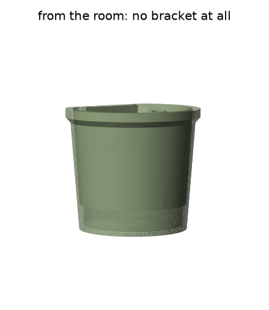

The hanging cradle and the wall bracket above are **gadgets** — they grip a
pot somebody else made. That is the right answer for a nursery pot and the
wrong one when you are printing the pot anyway: a bracket you have to look at
is a bracket that should have been part of the pot.

So a wall pot is round for most of its circumference and **flat across the
back**, and the female half of a French cleat is a pocket *inside* that flat.
The rail screws to the wall and disappears into it. Hung, there is no bracket:
the pot grows out of the wall.

```bash
python -m flowerpot --wall-pot set --bottom-diameter 130
python -m flowerpot --wall-pot set --pot-style hexagonal --wall-pot-round 0.8
python -m flowerpot --wall-pot set --wall-pot-well 40 --drainage-pattern grid
python -m flowerpot --wall-pot liner             # just another liner
```

**A wall pot is a pot** — same leverage as the sleeve. `pot_style`,
`vase_profile`, `surface_texture`, the rim and the colours all work on it,
because the outside is the same builder doing its usual job. Two planes and a
pocket are the whole difference.

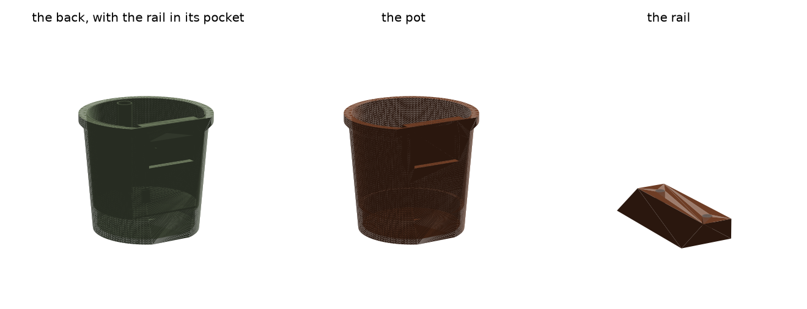

### Which way you rip the cleat is the entire mount

A full pot of wet soil sitting out from a wall is a **cantilever**, and a
French cleat carries no moment on its own — only shear. Two things fix that,
and they are the same two the wall bracket needed:

- The back **bears flat on the wall** either side of the pocket and below it,
  so the moment becomes a couple: the back pushes in low down, the pocket's
  ceiling holds out up top.
- The rail's bevel **rises away from the wall**. Tip the pot the way a full one
  tips it — top out, bottom in — and the pocket's ceiling drives down and out
  *into* the rail. Ripped the other way, the way a picture rail usually is, the
  same motion slides the two faces apart. Get this backwards and you have a pot
  that hangs beautifully until it is full.

That orientation also means the pot cannot be pulled straight off the wall. To
take it down you lift it past the rail's depth first, and the generator says how
far.

**The rise is 1.2, not 1.** A 45° mating face is a 45° overhang for whoever has
to print the socket side of it, and here that is the pot: it prints mouth up, so
the pocket's ceiling is a roof. A steeper rip prints at 40° with margin to
spare, wedges *harder* on the way down, and restrains the tipping just the
same — the restraint works for any rise above zero.

### One plane, two roundnesses

`wall_pot_round` is quoted where the pot is **narrowest**, and that is not a
detail. The back is one plane, so a tapered pot is roundest at the end the plane
barely reaches. Quote it at the widest instead and almost every pot asks for a
plane its own foot cannot reach — so the generator reports both numbers (87% at
the foot, 70% at the mouth, on the default). `0` takes as much as the pot allows.

### The back is only thick where the pocket is

The pocket is the rail's thickness deep, so the back needs that plus a skin.
Making the *whole* back that thick is most of a kilo of plastic for nothing, so
it is a pad on the inside of the back wall — ramped underneath so it prints —
and nowhere else.

### The liner, and the open space under it

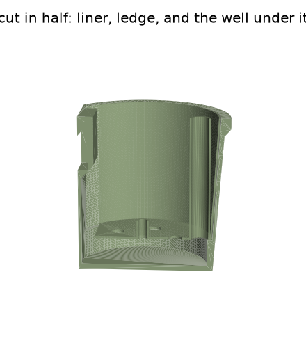

**The outer never gets a hole.** That is what a thing hanging on a wall has to
be, and holes are what a pot needs — so the holes go in a **thin liner** that
drops inside it instead. `drainage_pattern`, `num_drainage_holes` and
`drainage_hole_radius` all point at the liner; `num_side_holes` is refused
outright, because half of them would come out on the flat back.

The liner lands on a **ledge** and what is under it is a **well**. The outer's
cavity is a step — narrow well, ledge, then the pot's own taper — so going up it
only ever gets *wider*, which is why none of it needs a cone to print.

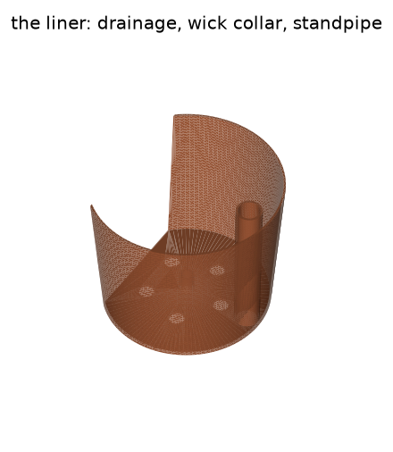

Three things go through the liner's floor:

- **Drainage**, so water you pour on the soil ends up in the well and not on the
  wall.
- **A wick collar** in the middle. Thread a cord down it and let it hang in the
  well: that is the difference between self-watering and a pot with a drip tray
  under it. Polyester or nylon — cotton rots.
- **A standpipe** up the inside, at the front. It fills the well without wetting
  the soil, and the water standing in it *is* the level in the reservoir.

The standpipe is at the front for a reason: it is the one azimuth guaranteed to
be clear of the flat back however flat that back is cut, and it is where you can
see down it. A flute down the back would have been neater and is impossible —
the pad behind the pocket is exactly the rail's depth plus a skin, so grooving
it breaks straight into the cleat.

There is **no overflow**, because an overflow is a hole in the outside. The well
is all it takes before the liner is standing in it, and the generator says how
many millilitres that is.

The liner is also where the polygon styles earn their keep: the cavity's
polyline carries a **corner** radius, so a square liner's outermost holes and
its standpipe are placed off the *inscribed* radius instead. Take the corner
radius and they come out through the middle of a flat.

### It works out what it will weigh

This is the one thing here nobody has to type in. Every other mount has to be
told its load; this one owns the cavity the soil goes in, so the load, the
centre of that soil and the moment are all **derived** — including where the
soil's centre of mass sits once the back plane has taken a slice off every disc
of it, which is what the moment is actually about. The sum is exact, and there
is a test that says the mesh agrees with it.

The numbers come out small (2.8 kg and 1.9 N·m on the default), and the finding
is worth stating plainly: **the pot's own back is never what limits this.** The
rail in bending between its screws is, and after that it is the wall. The screws
are the part this generator does not make.

## Nursery sleeve

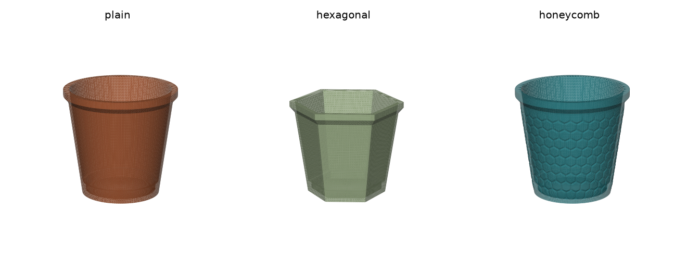

A cover for the pot the plant came in. Nobody wants to look at a black plastic
nursery pot, and nobody wants to repot a plant that has just been moved — the
pot drops in, pot and all, and what shows is the sleeve.

```bash
python -m flowerpot --sleeve --sleeve-pot-size 6in --color clay
python -m flowerpot --sleeve --sleeve-pot-size 6in --pot-style hexagonal
python -m flowerpot --sleeve --sleeve-pot-top 130 --sleeve-pot-base 100 \
                    --sleeve-pot-height 118 --surface-texture honeycomb
```

**A sleeve is a pot.** That is the whole design: its outside is built by the
same machinery as every other pot here, so `pot_style`, `surface_texture`, the
rim and the colours all work on it exactly as they do on a planter. Only the
inside is different, and the inside is not a design at all — it is the nursery
pot, plus a fit.

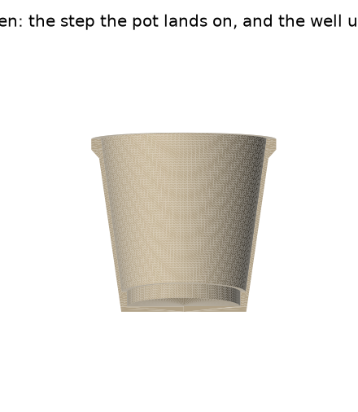

### The step, and the well under it

The cavity is a **step**: a straight well at the bottom, narrower than the
nursery pot's base, and the pot's space above it. The pot lands on the step and
the well is left under it.

A step in a cavity is usually a ceiling — but not this one. Going up, this
cavity only gets *wider* (well, then step, then the pot's own taper), so the
step faces the sky and the whole inside prints as wall. It is the cavities that
narrow going up that need a cone.

The well is what a cachepot is usually missing: somewhere for a drink to go
that is not the bottom of the pot. There is no drain, so what it holds is also
all it can hold — the generator reports the number, and `sleeve_well 0` is
allowed but argued with.

### What a sleeve cannot be

`vase_profile` is **refused** on a sleeve. Every one of those silhouettes necks
in at the mouth *and* narrows at the foot, and a sleeve has a pot inside it and
a well under it; there is nothing to negotiate, so it says so rather than
half-working.

Anything else that closes in on the pot — a narrow `sleeve_base`, a negative
`belly` — is caught by sweeping the wall end to end against the pot it has to
contain. A silhouette that pinches is rejected **with the height it pinched at
and how much it was short by**, rather than quietly producing a sleeve nothing
fits in.

For the polygonal styles there is a subtlety worth stating, because getting it
backwards is a sleeve whose own pot will not go in: a section is cut from its
**corner** radius, so the cavity is divided up by the flat factor. That puts
the *inscribed* circle on the nursery pot instead of the circumscribed one —
the flats are what the pot would come through first.

### Sizing

`sleeve_pot_size` fills in all three measurements from a nominal nursery size,
and says in a warning that it has: a 6 inch pot is 6 inches across the **top**,
its base is taken as 0.75 of that and its height as 0.95, which is about where
nursery pots land. Measure yours into `sleeve_pot_top` / `_base` / `_height` —
the reveal in particular depends on the height being right.

`sleeve_reveal` is where the two rims finish: `0` is flush, positive lets the
nursery pot's rim stand proud, negative hides it down inside.

## Under the pot

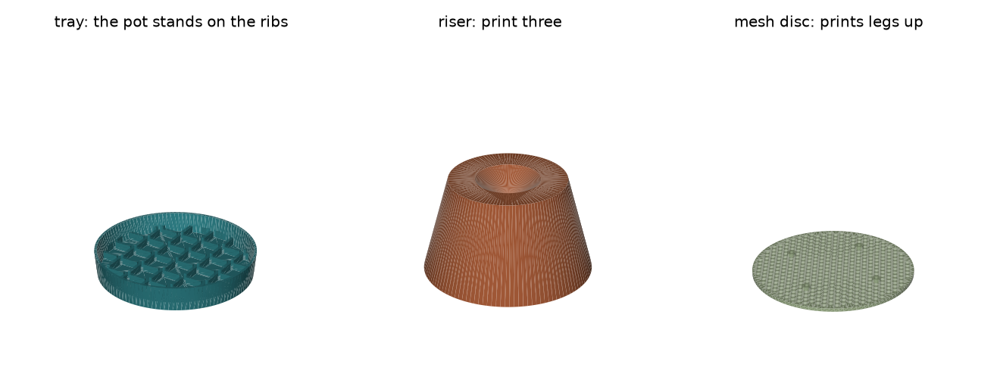

`generate_saucer` already makes a tray for a pot *this* generator built, by
measuring that pot. This is for the other case — the nursery pot, the glazed
one from the shop, the one already full of soil — where the only numbers
available are the ones a tape measure gives you. So all three parts are cut
from **one measurement: the diameter of the pot's base.**

```bash
python -m flowerpot --underpot set --under-pot-base 110
python -m flowerpot --underpot set --under-pot-size 6in     # a nominal size
python -m flowerpot --underpot tray --under-waffle 10       # more water
```

`set` writes `<name>_tray`, `<name>_riser` and `<name>_mesh`.

### The tray, and why it has a waffle

A flat saucer puts the pot's base in the water it just drained, which is the
thing a saucer is for. Ribs lift it clear and the water goes in the channels
between them. `under_waffle` is the rib height, and it is therefore also **how
much water the tray can hold before the pot is standing in it again** — which
is the number the generator reports, not the brim volume.

They are **crossing** ribs rather than radial fins, because the pot's base has
to land on at least three of them wherever it is set down and a radial fan
leaves the middle of the tray empty.

Every crossing is **broken** — a disc taken out of each junction. A continuous
waffle is a tray full of closed cells, each keeping its own puddle with no way
to level with the others or be poured out; opening the corners makes the water
under the rib tops a single connected body, which the tests check directly.
Every cut is vertical, so none of it costs anything in overhang.

### The risers

Print `under_feet` of them and stand the pot on that many. They sit on a circle
as far out as they go without any of the foot showing past the edge of the
base, because a foot inboard of the base is a foot the pot can tip over — the
generator reports the circle to use.

**Three cannot rock on an uneven surface and four can**; four spreads the load,
so take four on a heavy pot and a flat shelf. Each foot narrows going up, which
is the direction that cannot overhang, and its top is dished so the pot's edge
sits in it rather than walking off.

### The mesh disc

A pierced disc for the bottom of the pot, to keep the soil on the inside of the
drainage holes. Holes are hex packed — the arrangement that gets the most open
area for a given web — and every one is a vertical bore, the one cut that
leaves nothing to hold up.

What actually limits `under_mesh_open` is the **web** between holes: below a
couple of extrusions the disc stops being a disc, so the generator opens the
holes out rather than thinning the web, and reports what you actually got.

The legs print pointing **up** and the disc goes in the pot the other way
round. Printed downwards they would be four pillars with a disc bridged across
them.

### Sizing from a pot you did not make

`under_pot_size` is a nominal nursery size and nothing more. A pot sold as a
6 inch pot is 6 inches across the **top**; its base is narrower, and by how much
is up to whoever moulded it. The table takes 0.75 of the nominal top, which is
about where they land — near enough to print a saucer that works, not near
enough to argue with a tape measure. The generator says so in a warning every
time you use one. Measure yours and set `under_pot_base` instead; one
measurement fixes all three parts.

## Moss pole

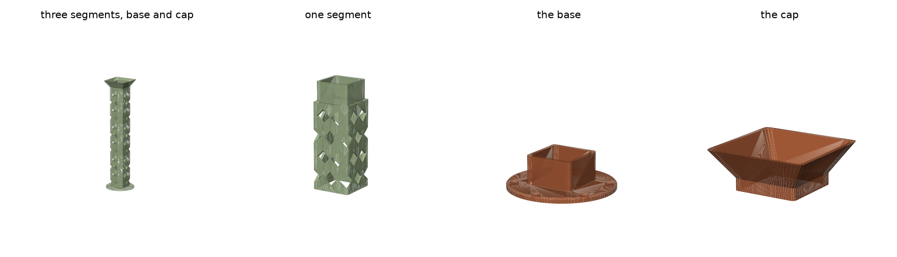

A hollow column you pack with sphagnum, in segments that stack. An aroid
climbs by putting aerial roots into something damp; this is the something —
open enough that roots get through the wall, and therefore much taller than
any build plate, so it comes apart.

```bash
python -m flowerpot --moss-pole set --color sage
python -m flowerpot --moss-pole set --pole-shape round --pole-open 0.8
python -m flowerpot --moss-pole set --pole-diameter 75 --pole-segments 5
```

`set` writes three files — `<name>_segment`, `<name>_base` and `<name>_cap`.
**The segments are identical, so only one is written**: print
`pole_segments` copies of it. The base is a wide pierced foot that buries in
the pot; the cap is a funnel that closes the top and is where you pour, so the
water runs down the packed moss instead of off the outside.

`pole_diameter` is the width **across the flats** on every shape — the number a
ruler gives you, and the number a shop pole is sold by.

### The joint

The top of each segment steps in to a **spigot** that slips inside the mouth of
the next, and the step it leaves is a flat annulus facing straight up — which is
what the segment above lands on, so the stack has an exact pitch. Both mating
surfaces are vertical, so both print as walls.

The bore has to neck in by a wall plus the fit to get inside the segment above,
and **a bore that narrows going up is a ceiling**, so the neck is coned at the
overhang budget rather than stepped.

On a square or hexagonal pole the spigot is the same polygon as the tube, which
**keys** the joint: the segments only go together one way round, the pattern
lines up, and nothing twists once a plant is leaning on it. A round pole spins —
that is a real difference between the shapes, and there is a test that asserts
it in both directions rather than glossing it.

Each joint swallows the spigot's height out of the segment above it, so a
150 mm segment buys 122 mm of column. The generator reports the number you
actually get, not the one you asked for.

### The wall

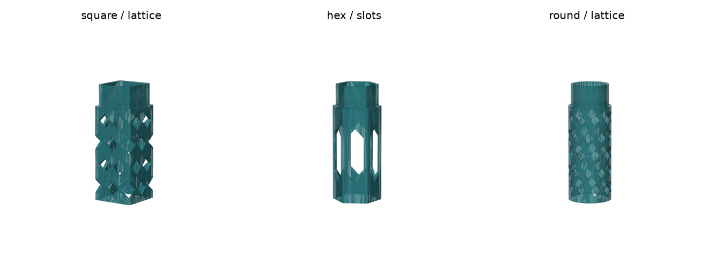

Every opening is a **pointed prism** — a rectangle with a gabled top and a V
underneath, cut straight through the wall. A plain rectangular slot through a
standing tube has a flat ceiling across the top of it; put a gable on that
ceiling at the overhang budget and the same opening prints with nothing under
it. The openings are therefore as wide as the budget allows and no wider.

| `pole_pattern` | Look | Notes |
|---|---|---|
| `lattice` | staggered diamonds | the classic moss-pole wall, most edge for a root to hook on |
| `slots` | the same opening with a straight waist let into it | fewer, taller windows: easier to pack, more open, less to grip |
| `solid` | no openings | a plain climbing stake |

Columns are a whole number per face — an **even** number, so they straddle the
face centre instead of sitting on it. That leaves the middle of every face
solid, which is where the barbs go and where a corner never is.

`pole_open` splits each cell between opening and strut; what stops it going to
1 is the strut left behind, and below about two extrusions wide the generator
refuses with the number it wanted.

### Barbs

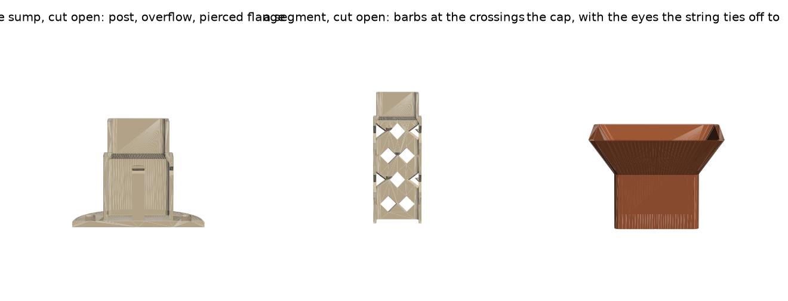

`pole_barbs` puts little shelves on the wall at the crossings of the pattern.
Each one is **flat on top**, because that is the face the moss rests on, and
its underside is not a choice: the ramp *is* the overhang budget, so the rise
is the reach divided by the slope and it lands exactly on the limit.

* `inside` (the default) stops the packed column settling away from the wall
  and slumping down the pole over a season.
* `outside` holds a sheet of moss you have wrapped round the pole while you get
  the twine on, and gives roots something to sit against.
* `both`, or `none` for a smooth bore.

They go on **before** the openings are cut, so an opening always wins — a barb
can never end up plugging one. Inside ones start above the socket at the bottom
of a segment, because down there the bore is full of the spigot below it and a
barb would be interference rather than grip.

### The sump, and the string

`pole_reservoir` closes the base into a cup and deepens it, so it holds water
under the column — about 95 ml at 40 mm on a 55 mm pole. **It is a sump, not a
tank.** What fills it is what you pour through the cap and what the moss does
not hold; what empties it is the bottom of the moss. A cotton wick lifts water
about a hand's width before the flow stops being worth counting, so the sump
feeds the bottom of the pole and the cap still feeds the rest. An overflow
through the wall sets the level, and what goes over it waters the pot — which
is where it was going anyway.

`pole_wick` adds the fittings for the string: **two eyes** through the cap's
collar, and a **post** standing in the sump for the loop to go under. Thread it
before you pack, so the string runs down the middle of the column and back up
rather than lying against the wall. Its real job is less lifting than
spreading — a wet string down the core wets the whole height when you pour,
instead of the water finding one channel and running past the rest.

The cap's collar grows when it carries the eyes, because an eye has to sit
*above* the spigot buried in the socket; any lower and it opens into the
half-millimetre gap round the spigot, where no string will go.

```bash
python -m flowerpot --moss-pole set --pole-reservoir 40 --pole-wick
python -m flowerpot --moss-pole segment --pole-barbs both
```

The holes in the base are counted exactly in the tests — six through the
flange, one overflow if there is water to overflow, one eye through the post —
because a cup with an extra hole in it is a cup that does not hold water.

Columns are a whole number per face, so an opening never lands on a corner —
the corner is the stiffest part of the section and the part you tie a stem to.
The cell they sit in is sized in **millimetres**, not as a fraction of the pole,
because what has to be big enough is a root and a finger and neither scales with
the diameter. `pole_open` then splits each cell between opening and strut; what
stops it going to 1 is the strut left behind, and below about two extrusions
wide the generator refuses with the number it wanted.

## Dish and keel

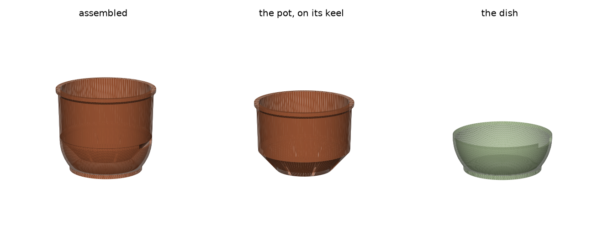

A pot that sits in a dish and drinks out of it. Two parts, no hardware, no
rope, nothing to buy: the **dish** is a solid bowl that holds the water, and
the **pot**'s bottom is not a floor but a **keel** — a cone that hangs down
inside the dish and dips into it. Slots up the keel put the soil in touch with
the water, so the column wicks and the pot waters itself for a week at a time.

```bash
python -m flowerpot --cradle set --color clay
python -m flowerpot --cradle set --cradle-bowl tub        # more water
python -m flowerpot --cradle set --cradle-diameter 160 --cradle-height 140
python -m flowerpot --cradle dish --cradle-windows 3      # just the dish
```

`set` writes `<name>_pot` and `<name>_dish`; `pot` and `dish` write one each.
Every dimension is a parameter and the two parts are solved together, so the
pair still nests at any size — there is a boolean fit proof in the tests to say
so.

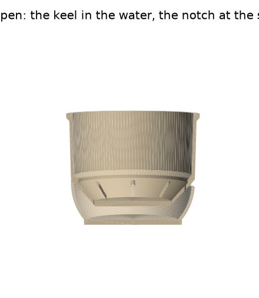

### The seat

The pot lands on the dish's rim by a **cone seat**: the underside of the pot's
collar and the top of the dish's rim are the *same cone*, so the pot centres
itself on the way down and cannot be put on crooked. It is left 0.25 mm loose
on the perpendicular — two printed cones never mate on their nominal surfaces,
and a pot that lands on one high spot rocks. Drop the pot a millimetre in the
tests and the seat is what stops it; that is what makes it a seat rather than a
pot hanging in a hole.

That one cone sets everything else. It is the keel, because a keel at the
overhang limit is the deepest one that fits under a given rim; the rim is the
keel, because that is what it lands on; and the bowl has to be shallower than
both, which is why the water gap can only open up as it goes down. Change
`overhang_limit_deg` and the whole pair re-solves.

### What a printer cannot copy

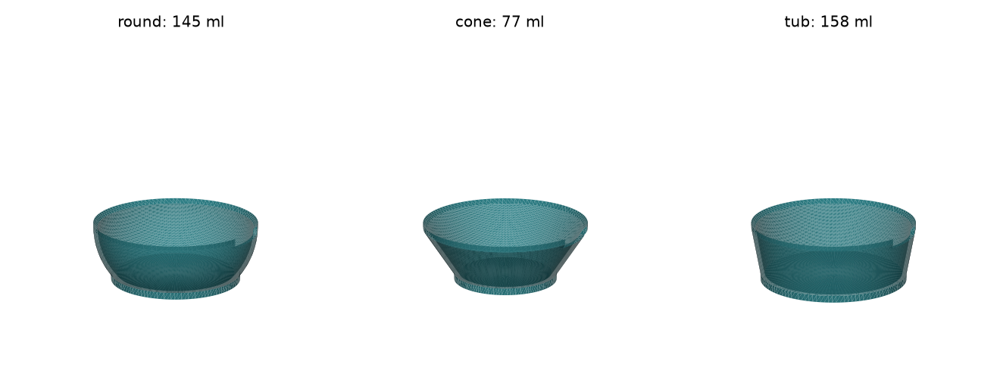

A dish shaped like a real bowl — round bottom, walls rising to vertical — is a
90° overhang at its pole and 60° round its flanks. It is the one part of the
shape a support-free print cannot have. Ours flares the other way: it stands on
a flat foot and opens **outwards** all the way to the rim, never past the
budget. `cradle_bowl` picks how hard, and that is also the water dial:

| `cradle_bowl` | Foot | Holds | Reads as |
|---|---|---|---|
| `round` | wide | ~145 ml | a circular arc that leaves the foot at exactly the limit and is vertical by the rim — the closest a support-free bowl gets to a bowl |
| `cone` | narrow | ~77 ml | a straight flare, the most dramatic silhouette and the least water |
| `tub` | widest | ~158 ml | nearly straight sides, the most water |

### Where the water goes in

Through a **notch in the dish's rim**, not through the pot. At the joint the
pot's skirt is one wall thick with the soil right behind it, so a hole there
empties the pot; the dish's rim has nothing above it at all, so a notch cut down
into it has no roof to hold up and every face it leaves is vertical or pointing
at the ceiling. Assembled, the two read as the same thing — a gap at the seam,
with the pot's keel sloping down over it and carrying whatever you pour straight
into the water.

The dish stays **solid**: no port, no grommet, nothing below its rim to leak.
The notch is the overflow as well as the inlet — fill until it runs back out at
you, and the level is set to the millimetre by where the notch's sill was cut,
a comfortable margin above the top of the wicking slots.

### The slots

The wicking slots are cut **straight down**. A vertical cut is the one cut that
can never leave an overhang: every face it makes is a vertical plane or a
vertical cylinder. Through a 42° keel that reads as a slit running up the cone,
which is exactly where it needs to be — the soil has to touch the water. Set
`cradle_drains 0` to close the keel and get a cachepot instead; the generator
says so rather than quietly handing you a pot that will not drink.

## Yard art

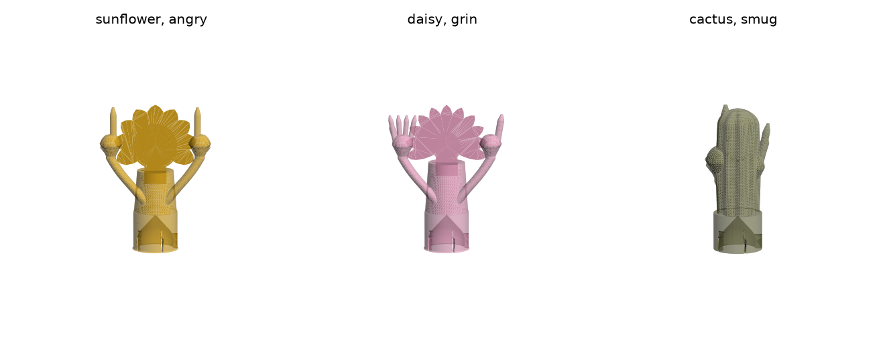

`--yard-plant sunflower` grows a plant with a face and an opinion: a
**sunflower**, a **daisy** or a **saguaro**, with eyes, eyebrows and two arms
that can be told what to do with themselves. It snaps onto a trailer ball,
screws onto the [collar](#trailer-hitch-mount), or stands on a plain disc.

```bash
python -m flowerpot --yard-plant sunflower --hitch-mount fused --hitch-ball 2
python -m flowerpot --yard-plant cactus --yard-face smug \
    --yard-left-hand bird --yard-right-hand shrug --hitch-mount screw
python -m flowerpot --yard-plant daisy --hitch-mount none --yard-face grin
```

`yard_face` is `angry`, `smug`, `grin`, `sideeye` or `none`; `yard_left_hand`
and `yard_right_hand` each take `bird`, `fist`, `thumbs`, `peace`, `horns`,
`wave`, `shrug` or `none` — mix them freely, one bird and one shrug reads
better than two of anything.

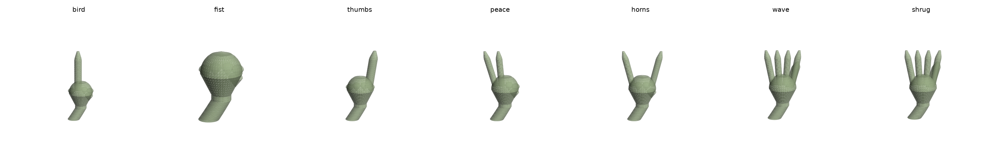

The hand has **four finger stations and a thumb**, and every station is
accounted for: the raised ones become tubes off the top of the fist, the rest
curl into knuckles round its front. That is not decoration — leave the other
fingers out and a thumbs-up and a raised middle finger are the same tube on the
same ball. The thumb is what settles it, so it is shorter, thicker and comes
off the *side*. A tucked thumb is a lobe rather than a tube, because a thumb
lying across a closed fist is nearly horizontal and a nearly horizontal tube is
a ceiling.

### Why the flower comes apart

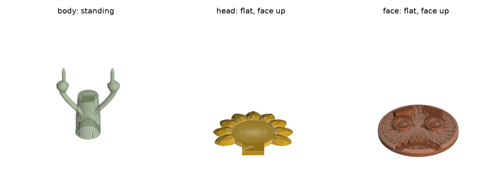

A flower head facing you is a **vertical disc**, and a vertical disc cannot
print without supports however you slice it: the bottom of its rim faces
straight down, and so does the underside of every petal that points sideways.
Leaning it back far enough to fix that leaves the flower staring at the sky.

So the head is its own part and it prints **lying flat, face up** — which turns
the problem into the feature. Every bit of the face becomes a *top* surface,
the best detail an FDM machine can produce and **zero** overhang, and the model
splits along its own colour lines:

| part | prints | colour |
|---|---|---|
| `<name>_body` | standing — mount, body, arms, hands | green |
| `<name>_head` | flat, face up — the petal ring | yellow |
| `<name>_face` | flat, face up — the seeded middle and the face | brown |

Three prints on a single-material machine, no paint. The face disc presses into
a pocket in the head; the head's tab drops into a slot in the body.

### The rules the standing parts still obey

* **An arm is a stack of horizontal rings drifting sideways as it climbs**, so
  its underside lean is exactly its centreline's lateral slope — *plus* its
  taper, because the two add. That is the real reason arms go up and out rather
  than straight out: not style, arithmetic. The climb is solved first, from
  where the hand should end up, and the reach is whatever the budget can buy
  over it. Hands are teardrops and fingers are tubes for the same reason.
* **The shoulders sit behind the head's plane.** The head's tab comes straight
  down the middle of the body and the arms start near the middle too, so
  without that they would be fighting over the same cubic centimetres. Setting
  them back is also where a pair of arms belongs.
* **Carving a standing wall has one rule, and it is stricter than it looks:**
  every mark must be *much* taller than it is wide. A vesica's cusp — the
  shallowest thing on it — closes at `arctan((b²−a²)/2ab)`, so at a 45° limit an
  upright mark needs to be **2.4×** as tall as it is wide, and leaning it 10°
  pushes that to **3.5×**. There is no angle that saves a long bar: tilting only
  moves *which* end roofs itself. So the saguaro has no eyebrows. It scowls with
  its eyes, and its mouth is a row of separate slits — gritted teeth, every one
  of them legal.

`yard_height` is the whole figure including its mount, and the head is sized
from what is left above the mount, so a fused socket does not squash the plant.

## Trailer hitch mount

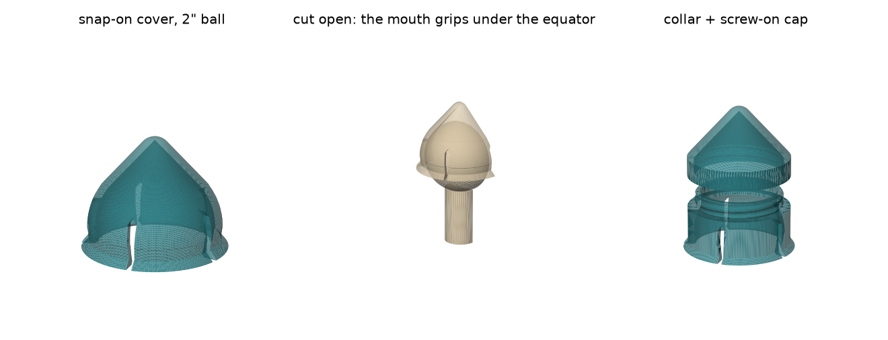

`--hitch-mount cover` prints a socket that snaps over a trailer ball. There is
nothing to tighten and nothing to lose: it is a spherical cup cut off *below*
the ball's equator, sliced into fingers that spread as you push it down and
close under the ball once it is on.

```bash
python -m flowerpot --hitch-mount cover --hitch-ball 2 --color charcoal
python -m flowerpot --hitch-mount screw --hitch-ball 2-5/16 --hitch-grip 1.3
```

> **Take it off before towing.** It sits where the coupler goes and it is not a
> structural part.

Three numbers decide whether a snap fit works, and all three are solved for:

* **The undercut** (`hitch_grip`, default 1.1 mm) is how much narrower the mouth
  is than the ball. It is the entire retention — and it is also exactly how far
  each finger has to bend, which sets everything else.
* **The slot length.** A finger is a cantilever: bending its tip by the undercut
  strains its outer fibre by `3·t·δ / 2·L²`. It is printed standing up, so that
  strain pulls *across* the layer lines, which is the weak direction. So the
  slots are sized **from** a 1.2 % strain target rather than from looks, and if
  the socket is too shallow to grow slots that long the generator says so and
  tells you what grip it would take (or to switch to PETG).
* **Where the cavity stops being a sphere.** A sphere's roof is flat at the top
  and no printer will bridge it. At the latitude where the ball's own surface
  reaches the overhang limit, the cavity leaves the sphere *on the tangent* and
  closes as a cone — which is both printable and the smallest lid that still
  clears the ball. Everything below the equator is free: a cavity that widens as
  it rises hangs over nothing.

The mouth seats about a third of a radius below the ball's centre, which keeps
the grip on the spherical part — real balls flare into their shank not far
below the equator. Fit is proved by booleaning an actual sphere into the actual
part, and the thread by sweeping the phase until the two helices share nothing.

`--hitch-mount screw` splits it into `<name>_hitch_collar` (the gripping socket,
with a coarse thread on top) and `<name>_hitch_cap` (a domed lid). One collar per
ball size then carries anything with the matching female thread, and the two
parts can be different colors. `hitch_ball` takes `1-7/8`, `2`, `2-5/16`, `3` or
a plain diameter in mm; `hitch_fingers` (default 5, odd is better — an even count
puts a slot opposite a slot) slices the socket.

## Self-watering set


`--self-watering` swaps the single pot for a two-piece set, exported as
`<name>_outer.*` and `<name>_inner.*`:

* the **outer pot** (your style, texture and color) is watertight and holds the
  reservoir. A refill tube runs up the outside of the wall — leaning with the taper so
  it stays fused at every height — ending in a funnel above the rim; a port near the
  floor connects it to the reservoir. Pour into the funnel to top up the water.
* the **inner pot** is the plant liner. Its floor is a 50° cone descending to a central
  **wick cup**, which is also what it stands on — soil sits above the water line
  ("propped up"), and the two rims end flush. Thread cotton rope through the wick
  holes around the cup so it hangs into the water; notches at the cup's foot let the
  water level equalise into the cup for bottom-watering.

Both pieces print upright with no supports (the port and notches are diamond-shaped
for exactly that reason), and the tests prove the inner drops into the outer without
touching — including the boolean intersection of the assembled pair.

Tune with `reservoir_height` (35 mm — how much water the outer holds),
`refill_tube_bore` (16 mm), `wick_hole_radius` (4 mm), `num_wick_holes` (3) and
`sw_wall_gap` (5 mm between the walls). `low_poly_faceted` cannot host the refill tube
(its facets rotate with height), any other style works:

```bash
python -m flowerpot --self-watering --pot-style hexagonal --surface-texture honeycomb \
    --color sage --format both --preview
```

## Universal reservoir insert


Already have a pot — printed or store-bought? `--reservoir-insert` generates a
**drop-in platform + fill tube** that makes any *watertight* pot self-watering (the
pot's own bottom becomes the tank, so use a cachepot or plug the drainage hole).
Exported as `<name>_insert.*` and `<name>_insert_tube.*`, both already in their print
orientation — no supports, no flipping in the slicer:

* the **platform** stands on a skirt at `reservoir_height` above the pot floor. Soil
  sits on the deck; a slotted wick cone descends into the water and soil pressed into
  it wicks moisture up. Drainage holes let excess top-watering escape into the tank,
  fins stiffen the deck, notches in the skirt let the water level equalise, and a
  slight draft lets it drop into tapered pots.
* the **fill tube** slips through the platform's collared socket; funnel on top, tip
  mitered at 50° so water always finds a way out even with the tube standing square
  on the pot floor.

Measure your pot's **inside width** where the deck will sit and pick the matching
outline — the insert mirrors the pot's shape:

```bash
python -m flowerpot --reservoir-insert --insert-shape hexagonal --insert-width 132
python -m flowerpot --reservoir-insert --insert-shape square --insert-width 110 \
    --reservoir-height 30 --insert-tube-length 180
```

`insert_shape` (`round` | `square` | `hexagonal` | `octagon`), `insert_width`
(measured across the flats for polygons; the print comes out with fit clearance,
rounded corners accounted for), `insert_tube_length`, plus the shared
`reservoir_height` and `refill_tube_bore`.

## Hydroponic tower


`--hydro-tower` generates a vertical hydroponic garden: **stackable column
segments** whose chamfered spigots drop into the mouth of the segment below, with
plant ports spiralling up the column, plus the matching **slotted net cup** and a
**top cap** with a drip-line hole. Print one segment per level and
`ports_per_segment` cups per segment; the bottom segment stands in any watertight
vessel (a classic pot with `--drainage-pattern none` works).

The port angle is where printability lives: a round port tilted A° above horizontal
has its worst overhang at 90 − A°, so the default `port_angle` 48 lands at 42° —
inside the no-support budget. Anything below 46 is rejected rather than silently
printing badly, and the geometry keeps the top port's shroud clear of the stacking
zone (the tests stack two segments and prove zero intersection).

Tune with `tower_diameter` (110), `segment_height` (160), `ports_per_segment` (3),
`port_bore` (50 — the cups are sized to match), `port_angle` (48) and
`drip_hole_diameter` (22):

```bash
python -m flowerpot --hydro-tower --name tower --ports-per-segment 4 \
    --tower-diameter 125 --segment-height 180 --color sage
```

## Mason-jar greenhouse


`--jar-greenhouse` turns any pot mouth into a seat for an **upside-down canning
jar** — a mini greenhouse over the seedling. The interior necks inward (never
steeper than 42°, so it still prints support-free) into a shelf with a circular
groove; the inverted jar's lip drops in, an upstand ring keeps it centred, and the
plant grows through the shaft in the middle. Four vent notches punch through to the
shaft so the greenhouse breathes — the tests verify that topologically, because an
airtight cloche cooks the seedling.

It works on the **classic pot**, on the **self-watering set's inner liner**, and the
**reservoir insert** gains a standalone collar ring to set on the soil. Not
available on the hydro tower. Size it with `jar_mouth_od`: 86 (default) fits US
wide-mouth canning jars, 70 fits regular-mouth:

```bash
python -m flowerpot --jar-greenhouse                            # classic pot
python -m flowerpot --self-watering --jar-greenhouse            # set, seat in liner
python -m flowerpot --reservoir-insert --jar-greenhouse         # + collar ring
python -m flowerpot --jar-greenhouse --jar-mouth-od 70          # regular-mouth jar
```

Each workflow form has it too: the classic form's *Extras* picker
(`saucer_and_jar` gives you both), and checkboxes on the self-watering and insert
forms.

## Modular garden

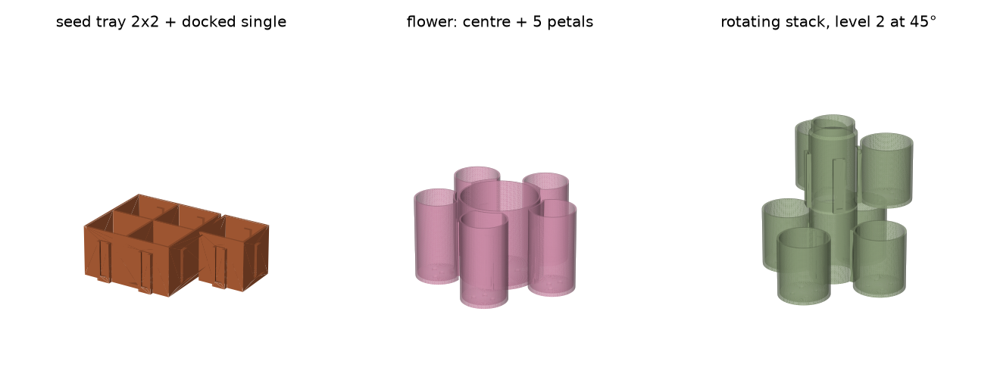

`--modular-kit` generates dovetail-connected sets. All three kits share **one joint
standard** — a vertical male rail that slides down into a slotted boss, with a
42°-chamfered foot and a slot floor that keeps mated pieces level — so anything with
a rail docks into anything with a boss, across kits:

* **`seed_cubes`** — small seed-starting pots with four drainage holes each, male
  rails on two faces and bosses on the opposite two. One run exports the single cube
  plus fused **2×2, 3×3 and 4×4 trays** whose edges carry one connector per cell, so
  singles and trays dock against each other at any offset. Tune `cube_size` (55) and
  `cube_depth` (60).
* **`flower`** — a round centre pot with five bosses at 72° and a petal pot whose
  back is **concave to hug the centre's curve**. Print one centre + five petals and
  the assembled set reads as a five-petal flower from above. Tune `flower_diameter`
  (140).
* **`stack`** — an open central hub (spigot on top, mouth below: the **round joint
  rotates to any angle**) with four boss slots for clip-on pod pots. Print one hub +
  four pods per level, stack as high as you like, twist each level to taste. Tune
  `stack_pod_diameter` (70).

The tests assemble every combination — a single docked on a tray edge, five petals
around the centre, two hubs stacked at an arbitrary 37°, a pod clipped on a hub —
and prove zero mesh intersection in each.

## Parameters

All dimensions in **millimetres**, angles in **degrees**. Defaults in brackets.

**Dimensions**

| Parameter | Default | Notes |
|---|---|---|
| `height` | 145 | build plate to rim |
| `top_diameter` | 150 | outside width at the top of the wall, *under* the rim |
| `bottom_diameter` | 105 | footprint width. Larger = more stable and less wall lean |
| `wall_thickness` | 3.0 | 2.4–3.2 mm suits a 0.4 mm nozzle; 1.2–1.6 for nursery-thin |
| `scale` | 1.0 | resize the proportions; walls, floor and clearances stay as set |
| `base_thickness` | 5.0 | floor under the soil; keep above `wall_thickness` |

For the polygonal styles the diameters are measured **corner to corner**, so the
bounding box of the STL always matches what you asked for.

**Drainage**

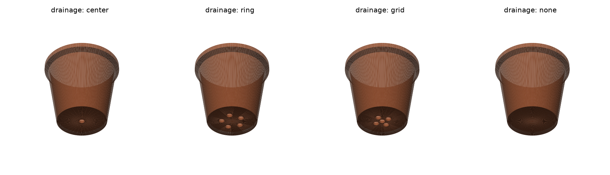

| Parameter | Default | Notes |
|---|---|---|
| `drainage_pattern` | `"ring"` | `center` \| `ring` \| `grid` \| `none` |
| `drainage_hole_radius` | 6.0 | radius, not diameter |
| `num_side_holes` | 0 | grow-pot side ports above the floor (0 = none) |
| `side_hole_radius` | 4.0 | half-width of each side port |
| `num_drainage_holes` | 5 | used by `ring` and `grid` |
| `drainage_ring_fraction` | 0.55 | ring radius as a fraction of the usable floor |

Holes are always clipped to the flat part of the floor and spaced so they cannot merge
into a slot. Asking for holes that cannot fit raises `ParameterError` rather than
producing a broken mesh.

**Rim and saucer**

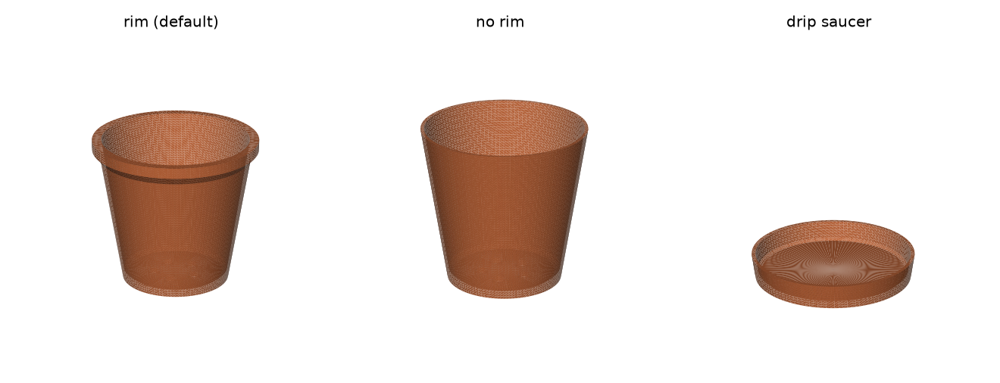

| Parameter | Default | Notes |
|---|---|---|
| `add_top_rim` | `True` | collar around the mouth |
| `rim_width` | 6.0 | projection past the wall, per side |
| `rim_height` | 10.0 | height of the straight collar |
| `rim_underside_angle` | 48.0 | chamfer under the rim, **from horizontal** |

**Print optimisation**

| Parameter | Default | Notes |
|---|---|---|
| `overhang_limit_deg` | 45.0 | steepest unsupported overhang, **from vertical** |
| `inner_base_chamfer` | 4.0 | 45° fillet where the inside wall meets the floor |
| `base_flat` | `True` | keep the footprint flat for bed adhesion |

**Texture** — `surface_texture` (`"none"`), `texture_depth` (1.0), `texture_cell` (16.0).

**Color** — `color` (`"terracotta"`), `accent_color` (`""` = single color).

**Printer** — `printer` (`"creality-k1-max"`); the machine profile embedded in the 3MF.

**Saucer** — `generate_saucer`, `saucer_clearance` (4.0), `saucer_height` (20.0),
`saucer_wall` (3.0), `saucer_base` (4.0). Written as `<name>_saucer.*`.

**Jar greenhouse** — `jar_greenhouse`, `jar_mouth_od` (86.0), `jar_seat_depth` (10.0).

**Vase** — `vase_profile` (`"none"`). **Stem** — `stem`, `stem_mount`
(`"printed"` fused | `"screw"` separate threaded piece), `stem_length` (130.0),
`stem_bore` (9.0), `stem_split` (`"auto"` | `"never"` | `"always"`),
`stem_curve` (6.0 mm of sway, 0 = straight), `num_branches` (2),
`branch_length` (70.0), `num_leaves` (5), `leaf_length` (55.0), `leaf_angle`
(25.0; max 30 fused, max 60 with insert leaves), `leaf_mount` (`"printed"` fused |
`"insert"` push-in leaf plate written as `<name>_leaves.*`), `soil_cap` (removable
raked-soil lid, written as `<name>_soil_cap.*`).

**Hitch mount** — `hitch_mount` (`"none"` | `"cover"` | `"screw"` |
`"fused"`), `hitch_ball` (`"2"`), `hitch_fingers` (5), `hitch_grip` (1.1).

**Self-watering pair** — `replica` (`"none"` | `"kyra"` | `"hdx"` | `"set"`),
`replica_pot_top` (152.4), `replica_pot_base` (119.38), `replica_pot_height`
(139.95), `replica_standoff` (25.0), `replica_plumbing` (True).

**Hanging loops** — `hang_loops` (0 = none, else 2-6), `hang_loop_bore` (5.0),
`hang_ceiling_plate` (False), `hang_plate_screws` (2), `hang_plate_screw_bore`
(4.5). Every pot parameter applies too.

**Holiday pots** — `holiday` (`"none"` | `"pumpkin"` | `"gourd"` |
`"cauldron"`), `holiday_face` (`"none"` | `"classic"` | `"cat"` | `"angry"` |
`"kawaii"`), `holiday_face_scale` (1.0), `holiday_lobes` (0 = whatever the
shape asks for), `holiday_lobe_depth` (0.0 = derive), `holiday_liner` (True),
`holiday_liner_holes` (4). Every pot parameter applies too, and the drainage
ones apply to the *liner* — nothing is ever cut into the face pot for water.

**Wall pot** — `wall_pot` (`"none"` | `"set"` | `"pot"` | `"cleat"`),
`wall_pot_round` (0.0 = as flat as the pot allows), `wall_pot_rail` (0.0 =
as long as the flat back has room for), `wall_pot_screws` (0 = as many as the
pull-out needs), `wall_pot_screw_bore` (4.5), `wall_pot_liner` (True),
`wall_pot_well` (25.0), `wall_pot_liner_wall` (1.6), `wall_pot_fill` (True),
`wall_pot_wick` (True). Every pot parameter applies too, and with a liner the
drainage ones apply to *it*.

**Hanging cradle** — `hanger` (`"none"` | `"set"` | `"base"` | `"arm"` |
`"top"`, plus `"cleat"` | `"rib"` | `"yoke"` on a wall mount),
`hanger_pot_size` / `_top` / `_base` / `_height` (as the sleeve),
`hanger_arms` (3), `hanger_drop` (240.0), `hanger_load` (5.0 kg),
`hanger_top` (`"hole"` | `"slot"` | `"ring"`), `hanger_clearance` (8.0),
`hanger_mount` (`"ceiling"` | `"wall"`), `hanger_reach` (150.0),
`hanger_cleat_length` (120.0), `hanger_screws` (0 = as many as the pull-out
needs), `hanger_screw_bore` (4.5).

**Nursery sleeve** — `sleeve` (False), `sleeve_pot_size` (`"custom"` or
`"3in"`…`"12in"`), `sleeve_pot_top` (152.4), `sleeve_pot_base` (114.3),
`sleeve_pot_height` (144.8), `sleeve_fit` (1.5), `sleeve_reveal` (0.0),
`sleeve_well` (14.0), `sleeve_base` (0.0 = derived). Composes with
`pot_style`, `surface_texture` and the rim; **not** with `vase_profile`.

**Under the pot** — `underpot` (`"none"` | `"set"` | `"tray"` | `"riser"` |
`"mesh"`), `under_pot_base` (110.0), `under_pot_size` (`"custom"` or
`"3in"`…`"12in"`), `under_clearance` (3.0), `under_waffle` (6.0), `under_rim`
(9.0), `under_riser_height` (18.0), `under_feet` (3), `under_mesh_diameter`
(0.0 = auto), `under_mesh_open` (0.35), `under_mesh_legs` (True).

**Moss pole** — `moss_pole` (`"none"` | `"set"` | `"segment"` | `"base"` |
`"cap"`), `pole_diameter` (55.0 across the flats), `pole_segment_height`
(150.0), `pole_segments` (3), `pole_shape` (`"square"` | `"hex"` | `"round"`),
`pole_pattern` (`"lattice"` | `"slots"` | `"solid"`), `pole_open` (0.68),
`pole_rows` (0 = auto), `pole_barbs` (`"none"` | `"inside"` | `"outside"` |
`"both"`), `pole_reservoir` (0.0 mm of water in the base), `pole_wick`
(False).

**Dish and keel** — `cradle` (`"none"` | `"set"` | `"pot"` | `"dish"`),
`cradle_diameter` (120.0 at the joint), `cradle_height` (108.0 assembled),
`cradle_dish_height` (44.0), `cradle_keel` (26.0), `cradle_bowl` (`"round"` |
`"cone"` | `"tub"`), `cradle_flare` (1.5), `cradle_windows` (1),
`cradle_drains` (8), `cradle_lip` (True).

**Yard art** — `yard_plant` (`"sunflower"` | `"daisy"` | `"cactus"`),
`yard_height` (200.0), `yard_head_diameter` (0.0 = auto), `yard_face`,
`yard_left_hand`, `yard_right_hand`.

**Bouquet** — `bouquet`, `bouquet_flower` (`"tulip"` | `"rose"`),
`bouquet_count` (5), `bouquet_head_diameter` (0.0 = auto), `bouquet_tilt`
(15.0, max 18).

**Self-watering** — `self_watering`, `reservoir_height` (35.0), `sw_wall_gap` (5.0),
`refill_tube_bore` (16.0), `wick_hole_radius` (4.0), `num_wick_holes` (3).

**Reservoir insert** — `reservoir_insert`, `insert_shape` (`"round"`),
`insert_width` (120.0), `insert_tube_length` (150.0).

**Hydroponic tower** — `hydro_tower`, `tower_diameter` (110.0), `segment_height`
(160.0), `ports_per_segment` (3), `port_bore` (50.0), `port_angle` (48.0),
`drip_hole_diameter` (22.0).

**Modular garden** — `modular_kit` (`"none"`), `cube_size` (55.0), `cube_depth`
(60.0), `flower_diameter` (140.0), `stack_pod_diameter` (70.0).

**Mesh quality** — `segments` (192 around the circumference; 128 is fast, 256 glassy) and
`vertical_step` (1.5 mm between rings). The faceted style deliberately ignores
`vertical_step` on the wall: long spans between rings are what make the facets flat.

---

## How the print requirements are met

**Manifold.** The two solids (body and cavity) are swept directly into triangle grids
with fan caps, so each is watertight by construction. Everything after that goes through
`manifold3d`, an exact boolean kernel: manifold in, manifold out. The finished mesh is
then re-checked — watertight, consistently wound, positive volume, no degenerate faces,
single body.

**No overhang past 45°.** Three things in a pot can overhang, and each is handled in the
geometry rather than left to supports:

* *The underside of the rim* is a chamfer, not a ledge. Its start height is solved by
  bisection so it hits `rim_underside_angle` exactly, whatever the wall is doing
  underneath it.
* *The decoration* (rib twist, facet rotation) is frozen at the foot of that chamfer. If
  the outline kept turning while the chamfer sloped outwards, the two motions would add
  up — that alone pushed the ribbed and faceted styles to 46–49° before it was fixed.
* *The wall lean* is `atan((top_radius - bottom_radius) / height)`; the validator warns
  before building if it exceeds the limit.

Every mesh is then audited empirically: each face normal is converted to a lean from
vertical (`arcsin(-nz)`), faces sitting on the build plate are excluded, and anything
past the limit is reported with its area. The defaults come out at 42°, comfortably
inside the limit.

**Flat base.** The footprint is a single flat disc on `z = 0`, and the report prints the
bed contact area (warning under 2 cm²). Pots are always dropped onto the plate and
centred in X/Y on export.

**Bonus check.** Each drainage hole that goes all the way through adds a handle to the
surface, so a correct pot has `genus == number of holes`. The tests assert exactly that —
it catches a hole that only dimpled the floor.

## Recipes

```bash
# 4" seedling pot with a single central hole
python -m flowerpot --height 90 --top-diameter 100 --bottom-diameter 75 \
    --wall-thickness 2.4 --drainage-pattern center --drainage-hole-radius 5

# chunky hexagonal succulent planter, no rim
python -m flowerpot --pot-style hexagonal --height 70 --top-diameter 95 \
    --bottom-diameter 85 --no-add-top-rim --drainage-pattern grid --num-drainage-holes 5

# tall spiral floor pot with a saucer
python -m flowerpot --pot-style ribbed_spiral --height 260 --top-diameter 220 \
    --bottom-diameter 170 --wall-thickness 3.6 --rib-count 30 --rib-twist-degrees 70 \
    --generate-saucer

# low-poly crystal, coarse and chunky
python -m flowerpot --pot-style low_poly_faceted --facet-count 6 --facet-bands 4

# two-tone quilted pot as a colored 3mf with a preview
python -m flowerpot --surface-texture diamonds --color cobalt --accent-color sand \
    --format both --preview
```

## Slicing

The pots are designed for **vase mode off**, 2–3 perimeters, 15 % infill, no supports.
A brim helps the taller ones. `wall_thickness` is deliberately a multiple of common
extrusion widths — 3.0 mm is 4 × 0.75 or 6 × 0.5 — so perimeters land cleanly and the pot
comes out watertight in the physical sense too.

## Project layout

```
flowerpot/
  params.py     PotParams - every knob, its default, and validation
  profile.py    the vertical silhouette (outer wall, rim, cavity, floor fillet)
  sections.py   the horizontal cross-section per style (round, polygon, ribs, facets)
  textures.py   the relief patterns (herringbone, honeycomb, diamonds, waves)
  build.py      sweeping, booleans, drainage, the saucer
  analysis.py   the print-readiness audit
  selfwatering.py the two-piece self-watering set (reservoir, tube, wick cup)
  insert.py     the universal drop-in reservoir insert (platform + fill tube)
  hydro.py      the hydroponic tower (segments, net cups, cap)
  jar.py        the mason-jar greenhouse seat and collar ring
  stem.py       the planted-flower stem and its lens leaves
  modular.py    the dovetail standard + seed cubes, flower set, rotating stack
  replica.py    the shop-vessel pair (planter + reservoir + wick cup)
  cradle.py     the dish-and-keel pair (a pot that drinks out of its dish)
  mosspole.py   the stacking moss pole (segment, base, funnel cap)
  underpot.py   tray, risers and drainage mesh for a pot you did not print
  sleeve.py     a cover for the nursery pot the plant came in
  hanger.py     flat parts that hang a pot from a hook or a wall cleat
  ceiling.py    loops on the pot's own rim, and a bar for the ceiling
  wallpot.py    a pot with the French cleat built into its flat back,
                and the thin liner and reservoir that go inside it
  colors.py     the palette and hex parsing
  printers.py   machine profiles + the slicer project payload
  threemf.py    minimal colored-3MF writer (thumbnail + project settings)
  preview.py    headless PNG renders
  export.py     build -> audit -> stl/3mf/png, shared by every front end
  cli.py        argparse front end generated from PotParams
generate_pot.py the edit-and-run script
.github/        the "Generate flower pot" workflow + CI
tools/          docs image renderer
tests/          the regression suite
```

## Tests

```bash
python -m pytest tests/ -q
```

They cover manifoldness and overhangs for every style and texture, dimensional
accuracy, measured wall thickness (by slicing the mesh and comparing the two loops),
drainage topology, saucer fit (boolean intersection with the pot must be empty),
texture guarantees (adds material only, seamless wrap, fades at base and rim),
STL and 3MF round-trips, color handling, parameter validation and the CLI.

## Previews

```bash
python tools/render_previews.py docs/img     # needs matplotlib
```
