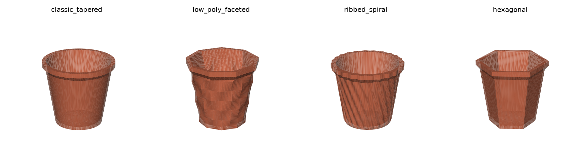

# Flower Pot STL Generator

Procedurally generate **watertight, 3D-printable flower pots** as `.STL` files from a
handful of parameters. Four design styles, four drainage layouts, an optional rim and a
matching drip saucer — every export is checked for manifoldness and unsupported
overhangs *before* it is written to disk.



---

## Install

```bash
pip install -r requirements.txt
```

`manifold3d` is the important one: it is the exact boolean kernel trimesh uses to cut the
cavity and the drainage holes. Without it the booleans fall back to something far less
reliable and watertightness is no longer guaranteed.

## Quick start

**Option A — edit and run.** Open [`generate_pot.py`](generate_pot.py), change the values
in the `PARAMS` block at the top, and run it:

```bash
python generate_pot.py
```

```
classic_tapered.stl
  OK   watertight
  OK   consistent normals (no inverted faces)
  OK   positive volume, 0 degenerate faces
  OK   overhangs: worst 42.0 deg vs 45 deg limit
       77780 faces / 38882 vertices, genus 5
       size 162.0 x 162.0 x 145.0 mm, material 277.6 cm3, bed contact 80.9 cm2
  -> output/classic_tapered.stl
```

**Option B — command line.** Every parameter is also a flag:

```bash
python -m flowerpot --list-styles
python -m flowerpot --pot-style hexagonal --height 120 --top-diameter 130
python -m flowerpot --all --generate-saucer --out output/    # one pot per style
python -m flowerpot --save-config mypot.json                 # save the settings
python -m flowerpot --config mypot.json                      # and reuse them
```

The CLI exits non-zero and refuses to write a file if the print audit fails; pass
`--force` to write it anyway.

**Option C — as a library.**

```python
from flowerpot import PotParams, build_pot, audit

pot = build_pot(PotParams(pot_style="ribbed_spiral", height=180, rib_twist_degrees=60))
print(audit(pot))
pot.export("spiral.stl")          # a plain trimesh.Trimesh
```

---

## Styles

Set with `pot_style` / `--pot-style`.

| Style | Look | Knobs that matter |
|---|---|---|
| `classic_tapered` | Smooth traditional nursery / terracotta pot | `belly` (0 = straight cone, 0.10 = plump urn) |
| `low_poly_faceted` | Geometric crystal — stacked bands of facets that rotate half a facet per band | `facet_count`, `facet_bands`, `facet_rotate` |
| `ribbed_spiral` | Vertical flutes, optionally twisted into a spiral | `rib_count`, `rib_depth`, `rib_twist_degrees` |
| `hexagonal` | Modern six-sided prism with crisp corners | `hex_sides` (8 = octagon), `hex_corner_round` |

The cavity follows the same cross-section as the outside, so the wall stays a constant
thickness whatever style you pick. Ribs are the exception: they are added *outside* the
nominal wall, so the wall is never thinner than `wall_thickness`.

## Parameters

All dimensions in **millimetres**, angles in **degrees**. Defaults in brackets.

**Dimensions**

| Parameter | Default | Notes |
|---|---|---|
| `height` | 145 | build plate to rim |
| `top_diameter` | 150 | outside width at the top of the wall, *under* the rim |
| `bottom_diameter` | 105 | footprint width. Larger = more stable and less wall lean |
| `wall_thickness` | 3.0 | 2.4–3.2 mm suits a 0.4 mm nozzle |
| `base_thickness` | 5.0 | floor under the soil; keep above `wall_thickness` |

For the polygonal styles the diameters are measured **corner to corner**, so the
bounding box of the STL always matches what you asked for.

**Drainage**

| Parameter | Default | Notes |
|---|---|---|
| `drainage_pattern` | `"ring"` | `center` \| `ring` \| `grid` \| `none` |
| `drainage_hole_radius` | 6.0 | radius, not diameter |
| `num_drainage_holes` | 5 | used by `ring` and `grid` |
| `drainage_ring_fraction` | 0.55 | ring radius as a fraction of the usable floor |

Holes are always clipped to the flat part of the floor and spaced so they cannot merge
into a slot. Asking for holes that cannot fit raises `ParameterError` rather than
producing a broken mesh.

**Rim**

| Parameter | Default | Notes |
|---|---|---|
| `add_top_rim` | `True` | collar around the mouth |
| `rim_width` | 6.0 | projection past the wall, per side |
| `rim_height` | 10.0 | height of the straight collar |
| `rim_underside_angle` | 48.0 | chamfer under the rim, **from horizontal** |

**Print optimisation**

| Parameter | Default | Notes |
|---|---|---|
| `overhang_limit_deg` | 45.0 | steepest unsupported overhang, **from vertical** |
| `inner_base_chamfer` | 4.0 | 45° fillet where the inside wall meets the floor |
| `base_flat` | `True` | keep the footprint flat for bed adhesion |

**Saucer** — `generate_saucer`, `saucer_clearance` (4.0), `saucer_height` (20.0),
`saucer_wall` (3.0), `saucer_base` (4.0). Written as `<name>_saucer.stl`.

**Mesh quality** — `segments` (192 around the circumference; 128 is fast, 256 glassy) and
`vertical_step` (1.5 mm between rings). The faceted style deliberately ignores
`vertical_step` on the wall: long spans between rings are what make the facets flat.

---

## How the print requirements are met

**Manifold.** The two solids (body and cavity) are swept directly into triangle grids
with fan caps, so each is watertight by construction. Everything after that goes through
`manifold3d`, an exact boolean kernel: manifold in, manifold out. The finished mesh is
then re-checked — watertight, consistently wound, positive volume, no degenerate faces,
single body.

**No overhang past 45°.** Three things in a pot can overhang, and each is handled in the
geometry rather than left to supports:

* *The underside of the rim* is a chamfer, not a ledge. Its start height is solved by
  bisection so it hits `rim_underside_angle` exactly, whatever the wall is doing
  underneath it.
* *The decoration* (rib twist, facet rotation) is frozen at the foot of that chamfer. If
  the outline kept turning while the chamfer sloped outwards, the two motions would add
  up — that alone pushed the ribbed and faceted styles to 46–49° before it was fixed.
* *The wall lean* is `atan((top_radius - bottom_radius) / height)`; the validator warns
  before building if it exceeds the limit.

Every mesh is then audited empirically: each face normal is converted to a lean from
vertical (`arcsin(-nz)`), faces sitting on the build plate are excluded, and anything
past the limit is reported with its area. The defaults come out at 42°, comfortably
inside the limit.

**Flat base.** The footprint is a single flat disc on `z = 0`, and the report prints the
bed contact area (warning under 2 cm²). Pots are always dropped onto the plate and
centred in X/Y on export.

**Bonus check.** Each drainage hole that goes all the way through adds a handle to the
surface, so a correct pot has `genus == number of holes`. The tests assert exactly that —
it catches a hole that only dimpled the floor.

## Recipes

```bash
# 4" seedling pot with a single central hole
python -m flowerpot --height 90 --top-diameter 100 --bottom-diameter 75 \
    --wall-thickness 2.4 --drainage-pattern center --drainage-hole-radius 5

# chunky hexagonal succulent planter, no rim
python -m flowerpot --pot-style hexagonal --height 70 --top-diameter 95 \
    --bottom-diameter 85 --no-add-top-rim --drainage-pattern grid --num-drainage-holes 5

# tall spiral floor pot with a saucer
python -m flowerpot --pot-style ribbed_spiral --height 260 --top-diameter 220 \
    --bottom-diameter 170 --wall-thickness 3.6 --rib-count 30 --rib-twist-degrees 70 \
    --generate-saucer

# low-poly crystal, coarse and chunky
python -m flowerpot --pot-style low_poly_faceted --facet-count 6 --facet-bands 4
```

## Slicing

The pots are designed for **vase mode off**, 2–3 perimeters, 15 % infill, no supports.
A brim helps the taller ones. `wall_thickness` is deliberately a multiple of common
extrusion widths — 3.0 mm is 4 × 0.75 or 6 × 0.5 — so perimeters land cleanly and the pot
comes out watertight in the physical sense too.

## Project layout

```
flowerpot/
  params.py     PotParams - every knob, its default, and validation
  profile.py    the vertical silhouette (outer wall, rim, cavity, floor fillet)
  sections.py   the horizontal cross-section per style (round, polygon, ribs, facets)
  build.py      sweeping, booleans, drainage, the saucer
  analysis.py   the print-readiness audit
  cli.py        argparse front end generated from PotParams
generate_pot.py the edit-and-run script
tools/          preview renderer (docs only)
tests/          35 regression tests
```

## Tests

```bash
python -m pytest tests/ -q
```

They cover manifoldness and overhangs for every style, dimensional accuracy, measured
wall thickness (by slicing the mesh and comparing the two loops), drainage topology,
saucer fit (boolean intersection with the pot must be empty), STL round-trips, parameter
validation and the CLI.

## Previews

```bash
python tools/render_previews.py docs/img     # needs matplotlib
```
